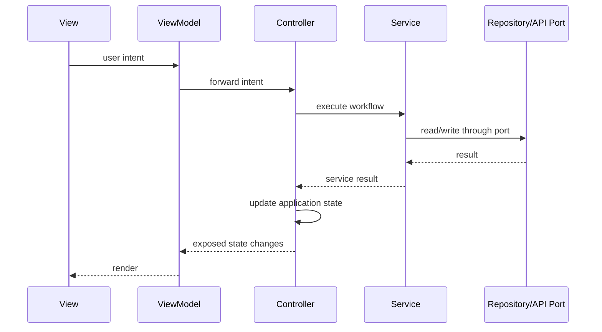
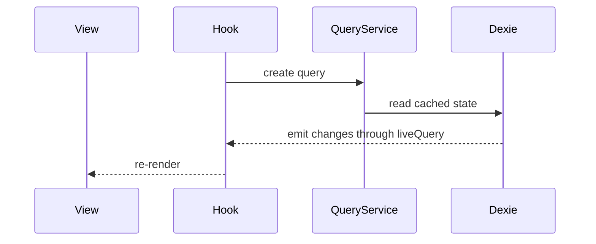
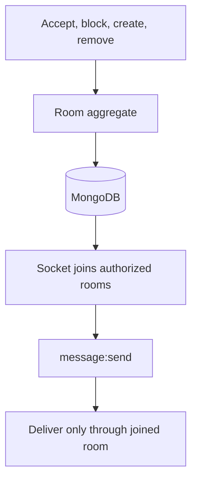

```mermaid
flowchart LR
    subgraph Client["Client Runtime"]
        React["React / ViewModels"]
        CController["Controllers"]
        CService["Application Services"]
        CDomain["Domain Models"]
        CAdapters["HTTP, Socket, Dexie adapters"]
    end

    subgraph Server["Server Runtime"]
        Express["Express / Socket.IO"]
        SController["Controllers"]
        SService["Application Services"]
        SDomain["Domain Models"]
        SAdapters["MongoDB, Redis, JWT adapters"]
    end

    React --> CController --> CService --> CDomain --> CAdapters
    CAdapters <-->|HTTP + Socket.IO| Express
    Express --> SController --> SService --> SDomain --> SAdapters
```

# Echo

⚠️ **Visiting the deployed app?** The application core is complete and tested, but the View/ViewModel layer is still being rebuilt. If the live site currently shows a stripped-down shell, that is intentional rather than a server failure. See [In progress](#in-progress).

---

> What if the application, not the framework, was the thing you actually designed—designed well enough that another developer, or an AI collaborator, could extend it correctly too?

Echo is a chat application built to explore a larger engineering question: **what changes when an application is designed around its own domain instead of the framework delivering it?**

Chat was a useful test case because it forces several difficult concerns to coexist:

- HTTP and WebSocket transports
- offline synchronization
- long-lived client state
- membership and blocking rules
- delivery/read state
- presence
- cross-domain coordination

The goal was not to prove that React or Express could be replaced in production. Framework interchangeability is only evidence of the deeper result: the application's behaviour does not depend on either framework to exist.

That decision led naturally to:

- **Domain-Driven Design** to define ownership and business rules
- **Hexagonal Architecture** to isolate the application from transports and persistence
- **MVVM** to keep React focused on presentation rather than application behaviour

Three consequences follow from that design:

- **The application was built before the UI existed.** Domains, services, controllers, persistence adapters, and workflows were implemented and tested headlessly. The View layer is the final adapter placed over an already working application.
- **AI became more useful as the architecture matured.** I designed the domains, algorithms, services, schemas, workflows, and initial tests. Once the codebase contained enough proven examples, repetitive implementation, additional testing, and fixes for surfaced gaps could be handed to AI and reviewed against an architecture that already constrained the correct solution.
- **The project documents its mistakes as carefully as its successes.** Echo was rebuilt after the original structure stopped scaling. This README explains what failed, what changed, and what I would still do differently.

Everything below—the testing strategy, the client architecture, the use of AI, and the ability to run the system headlessly—is a consequence of designing the application before designing its delivery mechanisms.

---

## Domains

| Domain | Server | Client | Responsibility |
| --- | --- | --- | --- |
| `authAndAccess` | ✅ | ✅ | Authentication, public identity, contacts, requests, and blocking |
| `conversations` | ✅ | ✅ | `Room` aggregate and participant membership |
| `messaging` | ✅ | ✅ | `Message` aggregate, sending, delivery, and read state |
| `sync` | ✅ | ✅ | Full/delta synchronization and the client sync cursor |
| `presence` | ✅ | ✅ | Redis-backed online/offline state and live presence events |

### Domain boundaries

`Room` owns membership. It does not own messages.

`Message` references a room by id, but it is a separate aggregate because sending or updating a message does not require an atomic mutation of the room itself.

`sync` is not persistence. It owns the cross-domain process that composes rooms, messages, and contacts into a client bootstrap/delta payload.

`presence` is independent of messaging. Online/offline state affects the user experience but does not belong inside the message or room model.

---

## What's built

- **Authentication** — registration, login, access tokens, refresh-token cookies, and session verification
- **Account deletion** — removes the user, updates contacts and rooms, redacts messages, and disconnects active sockets
- **Contacts** — email search, adding contacts, requests, blocking, mutual removal, and live updates
- **Conversations** — 1:1 and group-capable rooms, pending invitations, acceptance, and membership changes
- **Real-time messaging** — Socket.IO send/receive, multi-device delivery, delivery receipts, and read receipts
- **Offline-first persistence** — rooms, contacts, and messages stored in IndexedDB through Dexie
- **Full and delta sync** — cold bootstrap, reconnect reconciliation, and live `room:updated` propagation
- **Presence** — Redis-backed online/offline state with socket fan-out
- **Headless cross-boundary tests** — real client controllers driving a live server and database without React

## In progress

- Rebuilding the client View/ViewModel layer over the completed application core
- Expanding headless end-to-end workflow coverage
- Playwright tests for rendered UI behaviour
- Group-chat UI
- Typing indicators

## Deferred

- Message edit/delete
- End-to-end encryption
- Message reactions

---

## Stack

**Client**

React 19, Vite, TypeScript, React Router, Zustand, Axios, Dexie, Zod, Tailwind, shadcn/base-ui primitives, and Lucide.

**Server**

Express 5, TypeScript, MongoDB/Mongoose, Socket.IO, Redis, Zod, and JWT authentication.

Zod schemas define boundary contracts. TypeScript types are inferred from those schemas instead of duplicated manually.

---

# The engineering idea

Before Echo, I naturally approached features through framework vocabulary:

- Which component owns this?
- Which hook stores the state?
- Which route handles it?
- Which socket event sends it?

That makes the framework the place where the application is designed. Behaviour becomes distributed across components, hooks, route handlers, socket listeners, and persistence code because those are the structures the framework presents first.

Echo reversed that order.

Each feature started with application questions:

- What capability is being introduced?
- Which domain owns it?
- Which rules govern it?
- Which application service coordinates it?
- What state changes?
- Which delivery mechanism exposes it?

Only after those questions were answered did React, Express, Socket.IO, MongoDB, or IndexedDB become relevant.

The result is not framework-free software. Every framework still performs real work. The difference is that frameworks **deliver** behaviour instead of **defining** it.

That changed the development process as much as the code. Instead of holding UI, routing, sockets, state, APIs, and persistence in my head at once, I could complete one application capability at a time and prove it through its boundaries before building the interface around it.

---

# Why this much architecture?

Echo contains more code than a typical chat app with the same visible features. That is a real cost.

The goal, however, was not to discover the minimum amount of code required to build chat. The goal was to build an application where:

- business rules have one owner
- transports do not contain application logic
- persistence details do not leak across domains
- the client can run without React
- the server can run without Express request objects inside the core
- tests can construct the application directly
- new behaviour follows existing boundaries instead of creating new ones ad hoc

For this project, demonstrating those properties was the point.

## The first version

The project began like a normal React/Express application. Features were added directly through the frameworks, and the structure remained manageable while the domain was simple.

That changed as real rules accumulated:

- pending versus accepted rooms
- blocking across 1:1 and group conversations
- room membership
- offline state
- multi-device delivery
- account deletion across multiple data sets
- client/server synchronization

The problem was not that the application stopped working. The problem was that the same questions were answered independently in multiple places.

On the client, several hooks re-derived whether a room was pending or whether a participant was present.

On the server, services reached directly into another domain's repository and reproduced persistence mapping and rule checks.

The architecture did not tell a developer:

> This behaviour already has an owner. Call it here.

That made change increasingly expensive and made it difficult to know whether two pieces of code represented the same rule.

## The rebuild

The first attempt at a rebuild still compromised the boundaries. Services were exported functions importing concrete modules directly. The folders looked architectural, but the dependencies were not enforced.

The final rebuild introduced:

- class-based application services
- constructor injection
- explicit repository and transport ports
- composition-root wiring
- domain-owned aggregates
- controllers as the only application entry points
- fake adapters for isolated tests

This added ceremony, but it made the seams executable rather than decorative.

A service can now be constructed with a fake repository. A controller can be called without a framework. A domain can expose a clear public surface while keeping its persistence details private.

---

# How AI was used

AI did not determine how messaging, presence, synchronization, domain models, Mongoose schemas, or application services should work.

Those decisions required understanding the domain and choosing the behaviour that later implementations would follow. I designed those parts, implemented the first examples, and wrote the initial tests on both the client and server.

AI became increasingly useful only after the repository contained enough concrete examples to constrain the work.

The criterion for handing off a task was not:

> Can AI probably generate this?

It was:

> Does the codebase already contain enough examples that the correct implementation is defined by the existing architecture rather than invented from scratch?

That boundary moved over time.

### Early handoff: mechanical wiring

Composition-root entries became easy to delegate quickly because every registration followed the same pattern.

### Later handoff: extending established behaviour

Once several services and controllers existed, additional implementations could follow concrete conventions for:

- dependency injection
- result handling
- DTO validation
- state updates
- error translation
- socket fan-out
- repository boundaries

### Later still: testing and surfaced gaps

The first tests established the fake adapters, fixtures, setup patterns, and assertion style.

After enough examples existed, new tests became less about inventing a testing strategy and more about applying one. When those tests exposed gaps, AI could often propose fixes that matched the surrounding architecture.

Those changes were still reviewed. The tests proved behaviour, while the architecture provided the standard against which the implementation could be judged.

### What remained human-led

New behaviour never became mechanical simply because the project grew.

There is no prior pattern for a decision that has not yet been made.

Examples include:

- whether blocking dissolves a 1:1 room or removes a participant from a group
- whether pending rooms should receive messages
- how delivery state should be derived
- how Redis TTLs should represent presence after abnormal disconnects
- what belongs in the `sync` domain
- which aggregate owns a rule
- how client and server models differ

Those decisions create the patterns. They cannot be derived from earlier examples because they are the first example.

The result was a receding frontier: as architectural decisions accumulated, more implementation became predictable. AI usage increased toward the end of the project because less of the remaining work required discovering the design and more of it involved extending a design that was already visible in the code.

Eventually, the repository became more than an implementation. It became the specification for how it should be extended.

That is the real benefit I found in AI-assisted development: good architecture did not replace judgement; it concentrated judgement in the decisions that mattered and made the remaining work easier to review, test, and automate.

---

# The proof: the application runs headlessly

Echo was not merely tested headlessly. It was built that way.

Every major capability was implemented through domain models, services, controllers, and adapters before a component existed to call it.

## Server tests

The server exposes `createApp()` so its HTTP boundary can be exercised in-process with `supertest`.

No production port needs to be opened, and application services never depend on Express request or response objects.

## Client unit and integration tests

Client controllers and services are ordinary TypeScript. They can be constructed with fake APIs, fake sockets, and fake repositories.

React is not involved.

## Cross-boundary end-to-end tests

The client also contains tests that call its real controllers against a genuinely running server and database:

```text
register
  → login
  → delete account
  → attempt login again
  → login fails
```

This flow crosses:

- the client controller
- the client service
- Axios
- Express
- the server controller
- the server service
- MongoDB
- token/cookie handling

There is no browser, DOM, component tree, or React renderer in the process.

If the client application depended on React, this test would require browser automation. It does not.

The three testing layers have separate responsibilities:

```text
Server tests
  prove the server boundary and domain behaviour.

Client headless tests
  prove the client application and full client/server workflows.

Playwright
  will prove rendered UI behaviour.
```

The final UI layer can therefore be tested as presentation: given known ViewModel state, does the correct interface render and respond?

---

# One application, two runtimes

Echo is not a frontend and backend that happen to share a feature list. Both runtimes follow the same architectural shape.



The two runtimes are not identical. They solve different problems.

The server owns authoritative rules and persistence.

The client owns offline state, optimistic behaviour, synchronization context, and presentation-facing state.

What they share is the dependency direction:

```text
delivery mechanism
  → controller
  → application service
  → domain
  → port
  → adapter
```

The core does not import the framework at the edge.

---

# Client flow

On the client, a View does not call a repository, API, socket, service, or Zustand setter directly.



Each layer has a narrow role:

- **View** — renders state and emits user intent
- **ViewModel** — exposes workflow state/actions or read-only presentation data
- **Controller** — application entry point and state writer
- **Service** — coordinates the use case
- **Domain model** — owns rules and behaviour
- **Port** — defines an external capability
- **Adapter** — implements that capability with Axios, Socket.IO, Dexie, or another technology

## Workflow ViewModels

ViewModels are scoped to workflows rather than pages or arbitrary components.

Examples:

- login
- register
- send contact request
- block contact
- start conversation
- accept invitation
- send message

A workflow ViewModel exposes:

- the action the user can trigger
- progress/error state for that workflow
- any data that changes as a consequence of that workflow

Read-only data that does not represent a workflow is exposed through focused hooks, such as:

- room details
- room lists
- messages
- presence

Not every controller needs a ViewModel. Marking a conversation as read, for example, is a side effect of viewing it rather than a standalone user workflow.

## Reactive reads

Read paths sourced from IndexedDB do not need a controller because no application decision is being made.



Controllers remain the only writers of global application state. Reactive query hooks expose data without becoming alternate command paths.

---

# Domain modelling in practice

The value of DDD in Echo is not the folder names. It is that repeated questions became behaviour owned by a model.

## `Room` owns membership

Before the client rebuild, several call sites independently traversed `room.participants` to answer questions such as:

```ts
const myParticipant = room.participants.find(
  (participant) => participant.user.id === currentUserId,
);

const isPending = myParticipant?.status === "pending";
const isOneOnOne = room.participants.length === 2;
```

Other files repeated similar checks with slightly different assumptions.

The rebuilt `Room` model owns those questions:

```ts
room.statusFor(userId);
room.isPendingFor(userId);
room.isOneOnOne();
room.hasParticipant(userId);
```

The benefit is not fewer lines. It is one definition of the rule.

## One person, multiple domain concepts

The original `authAndAccess` domain used one `User` model for both authentication and public identity:

```ts
{
  id,
  firstName,
  lastName,
  email,
  password
}
```

That was two concepts hidden behind one name.

Authentication needs a password.

Contact search, room membership, and API responses do not.

The domain now distinguishes:

- `AuthUser` — authentication representation; password remains internal
- `Identity` — public representation used outside authentication

The previous presenter that manually stripped sensitive fields became unnecessary because the correct model is created in the first place.

## Domain models hydrate from persistence

A domain representation is not derived from another domain's representation.

`Identity`, `Participant`, and `Sender` may refer to the same person, but each is shaped by the language and rules of its own bounded context.

Repositories hydrate the model owned by their domain directly.

---

# Combining HTTP and WebSocket under one core

HTTP and Socket.IO are driving adapters into the same server application.

The transport determines how a request arrives, not where the behaviour lives.

A socket handler and an Express route both:

1. validate their boundary payload
2. invoke a controller
3. translate the result back to the transport

They do not own the use case.

That prevents chat behaviour from being split unpredictably between route handlers and socket listeners.

---

# Room membership as the access boundary

1:1 chat, groups, pending requests, blocking, and delivery appear to be separate features, but they converge on one question:

> Is this user currently a participant in this room?

`Room` is the aggregate root. `Participant` is an entity controlled by the room.

Only room behaviour changes membership:

```ts
room.acceptParticipant(userId);
room.removeParticipant(userId);
```

Blocking changes the room:

- in a 1:1 conversation, the shared room is dissolved
- in a group, the affected participant is removed while the room remains

Pending invitations do not prevent delivery. A pending participant is already a member; the status changes where the room appears in the client, not whether a message can reach it.

Sockets join the rooms that authoritative persistence says the user belongs to.



The message path remains simple because access was resolved by the membership model upstream.

The client is never trusted as the authority for room access.

---

# Offline-first client

The UI renders from IndexedDB, not directly from network responses.

Rooms, contacts, and messages are stored through Dexie. Network activity reconciles the local database, and reactive queries update the UI from that local state.

The bootstrap flow is:

```text
verify session
  → determine sync cursor
  → full or delta sync
  → persist results locally
  → connect socket
  → reconcile live events
  → application ready
```

This provides:

- immediate local reads
- reconnect support
- reduced dependence on in-flight network state
- one state source for both HTTP and socket updates
- a clear place to handle missed events

A generic `room:updated` event is reused by any operation that mutates room state. The client fetches or applies the authoritative update instead of every feature inventing its own presentation-specific socket event.

---

# Two client shells

The desktop and mobile interfaces are separate compositions of the same application capabilities.

They are not one layout progressively squeezed to smaller widths.

- **Desktop** — persistent navigation, conversation list, and active panel
- **Mobile** — bottom navigation and one primary screen at a time

Both consume the same workflow ViewModels and read hooks.

This is another consequence of separating the application from its interface: changing the composition of views does not require rebuilding the underlying workflows.

A terminal-style third interface is planned as another driving adapter over the same controllers. The purpose is not the aesthetic; it is to demonstrate the same application through a structurally unrelated interface.

---

# Gaps and tradeoffs

These are not hidden implementation notes. They are the places where I would change the process or architecture on another project.

## No root-level test/dev driver

MongoDB, Redis, client, server, and the separate test tiers are still started manually across multiple terminals.

A root script or containerized development harness should orchestrate that setup.

## Architecture came too late

The initial project began as an ordinary React/Express application because I underestimated how quickly messaging, membership, blocking, and synchronization would introduce real invariants.

A domain map and short architecture decision record before implementation would have exposed those concerns earlier.

## No group admin/removal, by omission

Group chats support adding a participant, but not removing one as a standalone action (the only removals that exist are self-removal via declining an invite, and removal as a side effect of blocking). Real "kick someone from a group" needs an admin/creator concept `Room` doesn't have today.

The reason it's missing isn't effort avoidance so much as a dependency I didn't see coming until I tried to add it: the moment an admin can be removed (an admin who gets blocked already goes through the existing removal path), something has to decide the new admin, and that rule would need enforcing at every call site that removes a participant — the block flow, account deletion, declining an invite — not just a new kick feature. That's a real, cross-cutting invariant discovered late, the same category as "Architecture came too late" above, not a UX nicety deferred on purpose.

## First rebuild preserved weak dependencies

The first attempt used architectural folders but retained direct module imports.

The final constructor-injected version is more verbose, but it makes the seam testable and enforceable.

## Tailwind utility classes clutter the JSX

Every component ends up with a long inline string of utility classes, which mixes display concerns into markup that should just describe structure. I used Tailwind because shadcn's components are styled that way and expect Tailwind classes to customize them.

Given the choice again, I'd keep Tailwind only where shadcn actually requires it and use plain, scoped CSS everywhere else — a `Header`/`Caption` component per repeated visual role instead of a repeated class string, with design tokens as CSS custom properties rather than Tailwind config. That keeps the same "no repeated styling logic" goal the rest of this project already holds itself to, just applied to the View layer instead of stopping short of it.

## Primitive ids at boundaries

Ids and emails still cross many boundaries as plain strings.

Branded value types such as `UserId` would prevent DTO mismatches like sending `{ contactId }` where `{ userId }` is expected.

I chose not to add that wiring cost during this project, but the stronger type boundary would be more correct.

## Client and server are separate contexts

The architecture initially treated similarly named client and server concepts as if they were one model.

`DeliveryStatus` demonstrates why that is incorrect:

- the server derives authoritative delivery/read state
- the client also needs `sending` and `failed`, which are local optimistic states

They share a name but not the same meaning.

## Native shells would be a stronger proof

Because the core is already UI-independent, React Native/Expo shells would demonstrate that separation more literally than two responsive web shells.

## Deliberate lack of hardening

Echo is a portfolio application rather than a public service.

It does not attempt to demonstrate:

- rate limiting
- complete transaction coverage
- production monitoring
- horizontal scaling
- abuse prevention

One operation uses a real Mongo transaction, but the repository does not pretend to be hardened for public traffic.

## Sync can't detect a phantom optimistic write

If a client makes an optimistic local write (a new room, an added participant) and misses the server's confirmation — disconnect, closed tab, dropped response — reconnect-time sync only reconciles entities the server confirms exist. It never diffs the client's full local dataset against the server's to prune something the server never actually created or persisted.

A correct fix needs either withholding the optimistic UI until the server confirms, or a full reconciliation sync instead of an additive delta — both a bigger change than this project's sync design attempts.

I'm treating this the same way as the hardening gaps above: real, and deliberately not built. This is a portfolio piece demonstrating an architecture, not a production service with real users and real network conditions at scale — the edge case is worth naming honestly, not worth the design cost of closing it here.

## No branching strategy

Every commit in this repo went straight to `master`. That was fine solo, but it means the history mixes finished work with mid-course corrections, and there was never a point where a diff could be reviewed as one clean unit before landing.

Given the choice again, I'd use GitHub Flow: short-lived branches per unit of work, merged back via a pull request once tests pass, `master` only ever changing through a merge. It's the same discipline the rest of this project already applies to code — a clean, reviewable boundary around a unit of work — just not extended to how the work actually lands in version control.

The claim is narrower: application behaviour is modelled deliberately and verified through tests.

---

# Current API surface

| Method | Path | Purpose |
| --- | --- | --- |
| POST | `/auth/register` | Create an account |
| POST | `/auth/login` | Authenticate and issue a session |
| POST | `/auth/verify` | Refresh/verify a session |
| POST | `/auth/delete-account` | Delete the authenticated account |
| GET | `/sync/user` | Full or delta user sync |
| POST | `/contacts/search` | Search identities by email |
| POST | `/contacts/add` | Add or request a contact |
| POST | `/contacts/block` | Block a contact |
| POST | `/rooms` | Create a room |
| POST | `/rooms/accept-invite` | Accept a pending invitation |
| GET | `/health` | Health check |

Socket events include:

```text
message:send
message:receive
message:delivered
message:read
room:updated
user:online
user:offline
```

---

# Running locally

There is currently no root-level runner, so client and server are started independently.

```bash
cd server
npm install
npm run dev
```

```bash
cd client
npm install
npm run dev
```

The server runs on `http://localhost:3000`.

The client runs on `http://localhost:5173`.

## Server environment

```env
JWT_ACCESS_SECRET=
JWT_REFRESH_SECRET=
MONGO_URI_LOCAL=mongodb://127.0.0.1:27017
MONGO_URI_ATLAS=
MONGO_DB=echo
PORT=3000
```

`NODE_ENV=production` selects `MONGO_URI_ATLAS`. Other environments use `MONGO_URI_LOCAL`.

The local MongoDB instance must run as a single-node replica set because account/contact operations use Mongo transactions.

Example setup:

```bash
mongosh --eval "rs.initiate()"
```

## Client environment

```env
VITE_API_URL=http://localhost:3000
```

## Tests

Fast unit/integration tests:

```bash
npm test
```

Cross-boundary client/server tests require both applications and their infrastructure to be running:

```bash
cd client
npm run test:e2e
```

The E2E suites use a real database and are intentionally run separately from the mocked test suites.

---

# Final note

Echo began as an attempt to build a chat application and became a way to develop a repeatable engineering process.

The most valuable result is not that the code can theoretically survive a framework change. It is that application behaviour can be designed, implemented, tested, reviewed, and extended without requiring the framework to define its shape.

That same separation also made AI collaboration more reliable. Once the architecture was explicit and the first examples were correct, generated work could be judged against real boundaries and real tests instead of accepted because it looked plausible.

The framework still matters.

It just no longer owns the application.
