# Echo

**Actively in progress.** The core domains (auth, contacts, conversations, messaging, sync, presence) work end-to-end and are tested, but the client UI and several features below are still being built — see [What's built](#whats-built) for the honest current split.

> What if the application, not the framework, was the thing you actually designed — designed well enough that another developer, or an AI collaborator, could extend it correctly too?

Echo is a chat application built to explore a larger engineering question: **what changes when an application is designed around its own domain instead of around the framework delivering it?**

Chat forces several difficult concerns to coexist: HTTP and WebSocket transports, offline synchronization, long-lived client state, membership and blocking rules, delivery/read state, presence, and cross-domain coordination. Designing around the domain first means every business rule has exactly one owner, transports and persistence stay out of application logic, and the application can be tested and verified without a browser or a running server in the loop.

That led to **Domain-Driven Design** (ownership and business rules), **Hexagonal Architecture** (isolating the application from transports and persistence), and **MVVM** (keeping React focused on presentation, not application behaviour).

The application was built and tested headlessly before any UI called it. Echo was also rebuilt once, after its original structure stopped scaling — the [Gaps and tradeoffs](#gaps-and-tradeoffs) section below is an honest account of what failed and what I'd still do differently.

---

## Domains

| Domain          | Server | Client | Responsibility                                                    |
| --------------- | ------ | ------ | ----------------------------------------------------------------- |
| `authAndAccess` | Yes    | Yes    | Authentication, public identity, contacts, requests, and blocking |
| `conversations` | Yes    | Yes    | `Room` aggregate and participant membership                       |
| `messaging`     | Yes    | Yes    | `Message` aggregate, sending, delivery, and read state            |
| `sync`          | Yes    | Yes    | Full/delta synchronization and the client sync cursor             |
| `presence`      | Yes    | Yes    | Redis-backed online/offline state and live presence events        |

`Room` owns membership, not messages. `Message` is a separate aggregate referencing a room by id. `sync` is not persistence — it composes rooms, messages, and contacts into a client bootstrap/delta payload. `presence` is independent of messaging.

---

## What's built

- **Authentication** — registration, login, logout, access tokens, refresh-token cookies, session verification
- **Account deletion** — removes the user, updates contacts and rooms, redacts messages, disconnects active sockets
- **Contacts** — email search, adding contacts, requests, blocking, mutual removal, live updates
- **Conversations** — 1:1 and group rooms, invitations, accept/decline, add participant, rename, leave group
- **Real-time messaging** — Socket.IO send/receive, multi-device delivery, delivery receipts, read receipts
- **Offline-first persistence** — rooms, contacts, and messages stored in IndexedDB through Dexie
- **Full sync** — cold bootstrap, reconnect reconciliation, live `room:updated` propagation
- **Presence** — Redis-backed online/offline state with socket fan-out
- **Headless cross-boundary tests** — real client controllers driving a live server and database without React

**In progress:** expanding headless end-to-end workflow coverage, Playwright tests for rendered UI, group-chat UI, typing indicators, unified contact/participant search.

**Deferred:** message edit/delete, end-to-end encryption, message reactions, group admin/removal (see [Gaps](#gaps-and-tradeoffs)).

---

## Stack

**Client** — React 19, Vite, TypeScript, React Router, Zustand, Axios, Dexie, Zod, Tailwind, shadcn/base-ui primitives, Lucide.

**Server** — Express 5, TypeScript, MongoDB/Mongoose, Socket.IO, Redis, Zod, JWT authentication.

Zod schemas define boundary contracts; TypeScript types are inferred from them instead of duplicated manually.

---

## Architecture

Both runtimes follow the same shape: delivery mechanism → controller → application service → domain → port → adapter. The core never imports the framework at the edge.

```mermaid
flowchart LR
    subgraph Client["Client Runtime"]
        React["React / ViewModels"]
        CController["Controllers"]
        CService["Application Services"]
        CDomain["Domain Models"]
        CAdapters["HTTP, Socket, Dexie adapters"]
    end

    subgraph Server["Server Runtime"]
        Express["Express / Socket.IO"]
        SController["Controllers"]
        SService["Application Services"]
        SDomain["Domain Models"]
        SAdapters["MongoDB, Redis, JWT adapters"]
    end

    React --> CController --> CService --> CDomain --> CAdapters
    CAdapters <-->|HTTP + Socket.IO| Express
    Express --> SController --> SService --> SDomain --> SAdapters
```



On the client, a View never calls a repository, API, socket, service, or Zustand setter directly — it emits intent to a **ViewModel**, which forwards to a **Controller** (the only writer of application state), which runs a **Service** against a **domain model** through a **port**. ViewModels are scoped to workflows (login, send message, block contact), not pages — a workflow ViewModel exposes the action, its progress/error state, and any resulting data. Read-only data that isn't a workflow (room lists, presence) is exposed through focused hooks reading live queries directly, with no controller involved.

Server tests exercise the HTTP boundary in-process via `createApp()` and `supertest` — no port needs to be open, and services never depend on Express request/response objects. Client controllers and services are plain TypeScript, constructed with fake APIs/sockets/repositories, with no React involved. A third tier of cross-boundary tests calls real client controllers against a genuinely running server and database (register → login → delete account → login fails) with no browser or DOM in the process.

---

## How AI was used

I designed the domains, algorithms, services, schemas, and workflows, and wrote the first tests on both sides. AI became useful once the codebase held enough concrete examples that the correct implementation was constrained by the existing architecture rather than invented from scratch — mechanical composition-root wiring first, then extending established services/controllers/tests following visible conventions, then proposing fixes for gaps that tests surfaced. All of it was reviewed against the architecture and the tests, not accepted because it looked plausible.

Decisions with no prior example in the codebase stayed human-led: whether blocking dissolves a 1:1 room or just removes a participant, whether pending rooms should receive messages, how delivery state is derived, what belongs in the `sync` domain. Those decisions can't be delegated because they're what create the pattern the next similar decision follows.

---

## Gaps and tradeoffs

These aren't hidden implementation notes — they're the places I'd change the process or architecture on another project.

### No root-level test/dev driver

MongoDB, Redis, client, server, and the separate test tiers are still started manually across multiple terminals. A root script or containerized dev harness should orchestrate that.

### Auth and realtime could have been offloaded

I built authentication and Socket.IO-based realtime myself instead of offloading them to a third-party platform like Supabase. In hindsight I wish I hadn't: a real slice of the total effort in this project went into socket management specifically — connection lifecycle, multi-device fan-out, reconnect/resync, presence TTLs — none of which is a differentiated feature of a chat app, just infrastructure a chat app needs working underneath it.

That effort was defensible as an architecture exercise (the point was to prove behaviour lives in the domain, not the transport), but if the goal had instead been to ship more actual product features in the same time, a managed auth/realtime provider would have let me spend that effort on features instead of transport plumbing. Worth naming as a real tradeoff rather than assuming hand-rolling everything was obviously the right call.

### Design came too late

Architecture was the point of this project, but the design work behind it wasn't done up front. I wrote services and worked out flows ad hoc — no context map, no written list of services/queries/events/invariants — because I assumed the domain would stay simple. It didn't: messaging, membership, blocking, and synchronization all introduced real invariants I only discovered by hitting them in code.

A concrete case: the server has two separate, independently-guarded services — `AddContactService` (search any user by email) and `AddParticipantToRoomService` (add an already-known user to a room). I'd separately worked out that add-participant's search step doesn't need a server call at all — the client's already-synced local contacts list is sufficient. But that decision lived only in my head, so while wiring the client's "add participant" dialog I forgot it and pointed the search at add-contact instead, which finds any user rather than only the viewer's own contacts. A context map would have recorded that decision the moment it was made, instead of relying on me remembering it correctly weeks later.

### No group admin/removal, by omission

Group chats support adding a participant and leaving voluntarily, but not removing someone else as a standalone action — the only involuntary removals are a side effect of blocking. Real "kick someone from a group" needs an admin/creator concept `Room` doesn't have today.

This wasn't effort avoidance — it's a dependency I didn't see coming until I tried to add it. The moment an admin can be removed, something has to decide the new admin, and that rule would need enforcing at every call site that removes a participant (block flow, account deletion, declining an invite), not just a new kick feature. That's a real, cross-cutting invariant discovered late, same category as "Design came too late" above. Full delete-for-everyone was rejected for the same reason: without an owner, there's no principled answer to who's allowed to dissolve a room out from under everyone else.

Voluntary self-removal ("Leave group") reuses the invite-decline mechanism rather than being its own feature — a room invite _is_ pending membership (`Room.create`/`addParticipant` add the invitee immediately, just with status `"pending"`), so declining an invite and leaving an accepted room are the same domain operation, "remove me from this room," regardless of status. `Room.removeParticipant` never checked status, so no new server code was needed, just a test proving the already-accepted case.

### First rebuild preserved weak dependencies

The first rebuild attempt used architectural folders but retained direct module imports between them — the folders looked right, but nothing enforced the boundaries. The final constructor-injected version (class-based services, explicit ports, composition-root wiring, controllers as the only entry points) is more verbose, but the seams are now testable and enforceable rather than decorative.

### Tailwind utility classes clutter the JSX

Every component ends up with a long inline string of utility classes, mixing display concerns into markup that should just describe structure. I used Tailwind because shadcn's components expect it for customization.

Given the choice again, I'd keep Tailwind only where shadcn actually requires it and use plain, scoped CSS everywhere else — a `Header`/`Caption` component per repeated visual role instead of a repeated class string, with design tokens as CSS custom properties. Same "no repeated styling logic" goal the rest of the project holds itself to, just not extended to the View layer.

### Primitive ids at boundaries

Ids and emails still cross many boundaries as plain strings. Branded value types such as `UserId` would prevent DTO mismatches like sending `{ contactId }` where `{ userId }` is expected. I chose not to add that wiring cost during this project, but the stronger type boundary would be more correct.

### Client and server are separate contexts

The architecture initially treated similarly named client and server concepts as one model. `DeliveryStatus` shows why that's wrong: the server derives authoritative delivery/read state, but the client also needs local-only `sending` and `failed` optimistic states. Same name, different meaning.

### Native shells would be a stronger proof

Because the core is already UI-independent, React Native/Expo shells would demonstrate that separation more literally than two responsive web shells.

### Deliberate lack of hardening

Echo is a portfolio application, not a public service. It doesn't attempt rate limiting, complete transaction coverage, production monitoring, horizontal scaling, or abuse prevention. One operation uses a real Mongo transaction, but the repository doesn't pretend to be hardened for public traffic.

### Sync can't detect a phantom optimistic write

If a client makes an optimistic local write (a new room, an added participant) and misses the server's confirmation — disconnect, closed tab, dropped response — reconnect-time sync only reconciles entities the server confirms exist. It never diffs the client's full local dataset against the server's to prune something the server never actually persisted.

A correct fix needs either withholding the optimistic UI until the server confirms, or a full reconciliation sync instead of an additive delta — both bigger than this project's sync design attempts. Real, and deliberately not built.

### No branching strategy

Every commit went straight to `master`. Fine solo, but the history mixes finished work with mid-course corrections, and no diff was ever reviewed as one clean unit before landing.

Given the choice again, I'd use GitHub Flow: short-lived branches per unit of work, merged back via PR once tests pass, `master` only changing through a merge. Same discipline the rest of this project already applies to code, just not extended to how the work lands in version control.

---

## Current API surface

| Method | Path                   | Purpose                          |
| ------ | ---------------------- | -------------------------------- |
| POST   | `/auth/register`       | Create an account                |
| POST   | `/auth/login`          | Authenticate and issue a session |
| POST   | `/auth/verify`         | Refresh/verify a session         |
| POST   | `/auth/logout`         | End the current session          |
| POST   | `/auth/delete-account` | Delete the authenticated account |
| GET    | `/sync/user`           | Full or delta user sync          |
| POST   | `/contacts/search`     | Search identities by email       |
| POST   | `/contacts/add`        | Add or request a contact         |
| POST   | `/contacts/block`      | Block a contact                  |
| POST   | `/rooms`               | Create a room                    |
| POST   | `/rooms/accept-invite` | Accept a pending invitation      |
| POST   | `/rooms/participants`  | Add a participant to a room      |
| POST   | `/rooms/rename`        | Rename a room                    |
| GET    | `/health`              | Health check                     |

Socket events include `message:send`, `message:receive`, `message:delivered`, `message:read`, `room:updated`, `user:online`, `user:offline`.

---

## Running locally

No root-level runner yet — client and server start independently.

```bash
cd server && npm install && npm run dev
```

```bash
cd client && npm install && npm run dev
```

Server on `http://localhost:3000`, client on `http://localhost:5173`.

**Server `.env`:**

```env
JWT_ACCESS_SECRET=
JWT_REFRESH_SECRET=
MONGO_URI_LOCAL=mongodb://127.0.0.1:27017
MONGO_URI_ATLAS=
MONGO_DB=echo
PORT=3000
```

`NODE_ENV=production` selects `MONGO_URI_ATLAS`; other environments use `MONGO_URI_LOCAL`. The local MongoDB instance must run as a single-node replica set, since account/contact operations use Mongo transactions:

```bash
mongosh --eval "rs.initiate()"
```

**Client `.env`:**

```env
VITE_API_URL=http://localhost:3000
```

**Tests:**

```bash
npm test          # fast unit/integration (fakes)
cd client && npm run test:e2e   # cross-boundary, needs both apps + real DB running
```

---

## Final note

Echo began as an attempt to build a chat application and became a way to develop a repeatable engineering process. The most valuable result is that application behaviour can be designed, implemented, tested, reviewed, and extended on its own terms, independent of where the UI or transport code happens to live. That same separation made AI collaboration more reliable: once the architecture was explicit and the first examples were correct, generated work could be judged against real boundaries and real tests instead of accepted because it looked plausible.
