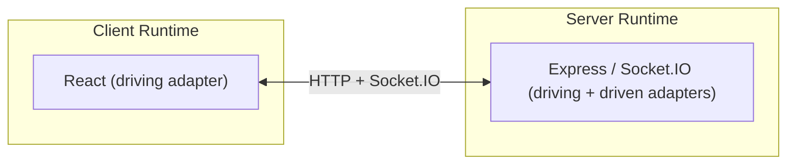
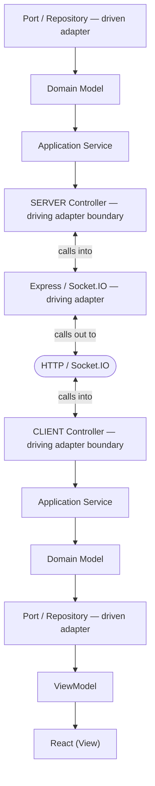
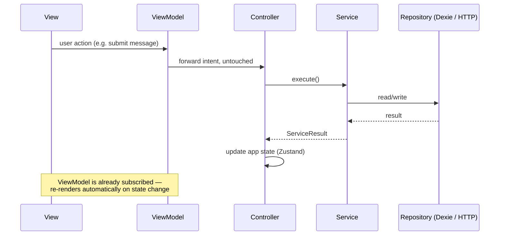
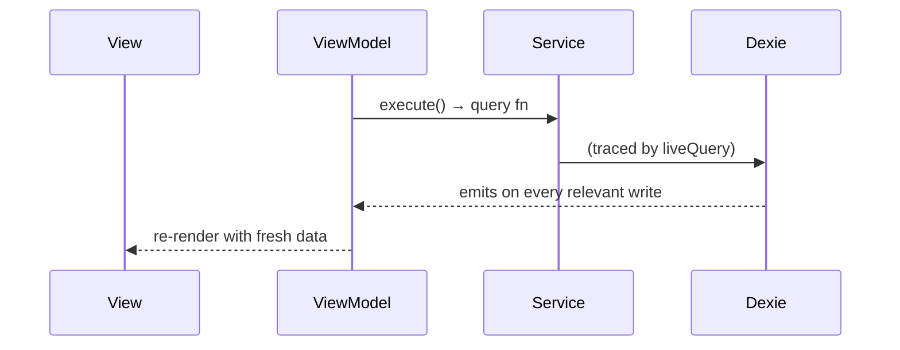
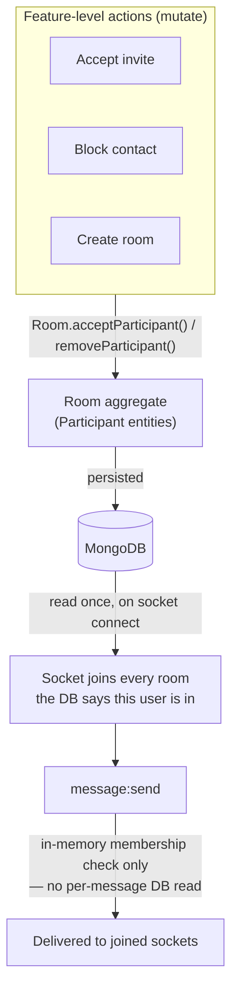

# Echo

> **Note if you're visiting the deployed site right now:** the UI is currently gutted down to stripped markup with nothing bound to it — you'll hit a login form with no working functionality. This is deliberate, not broken: the entire application core was built and fully tested headless first, and the View/ViewModel layer is being rebuilt on top of it now. See [In progress](#in-progress) below for what's left and why.

> What if the application, not the framework, was the thing you actually designed — designed well enough that an AI collaborator could extend it correctly too?

This project is about architecture, not chat. I wanted one application core, expressed the same way on the client and the server, decoupled from React and Express to the point that either could be deleted and the core would still work correctly. Chat is the domain I used to force that: it needs two transports at once (a message send is a live event, auth and sync are ordinary requests) and enough cross-cutting rules — membership, blocking, offline sync — that the modeling actually gets hard.

Domain-Driven Design, Hexagonal Architecture, and (on the client) MVVM are applied end to end on both sides. React, Express, Socket.IO, MongoDB, and IndexedDB all do real work, but none of them own the application — each is an adapter plugged into a core that exists whether or not it's running.

Three things follow directly from that, each elaborated further down for anyone who wants the full argument:

- **The whole application can be built and tested headless.** A `ViewModel` is nothing more than an abstraction over some view — a page, a list item, a badge — so until it's written, there's no UI to build against yet. Every domain here, including `presence`, was designed, built, and fully tested through controllers and services first, with no component ever in the loop, before the view layer existed at all. See [The proof: the whole system runs headless](#the-proof-the-whole-system-runs-headless).
- **The same rigor made this a better codebase to collaborate with an AI on.** Enforcing one consistent shape across every domain — same ports, same composition root, same test pattern — means a new domain can be extended correctly by someone with zero memory of any prior design conversation, without re-deriving the architecture's own rules first. Constructor injection specifically means real tests were available immediately, not just code that compiled: a fake dependency could be passed in and asserted against from the first line written. That's a payoff of the engineering discipline, not a substitute for it. See [Why this much architecture for a 5-domain app](#why-this-much-architecture-for-a-5-domain-app).
- **This README also says where I got it wrong.** The project started under a naive assumption about how simple the domain would stay, needed a real mid-project rebuild once that assumption broke, and still has concrete process/tooling gaps I haven't closed. See [Gaps — what I'd do differently](#gaps--what-id-do-differently) right below.

**One thing worth saying plainly up front: as of 2026-07-24, every domain's application core has been built and fully tested with the View and every ViewModel deliberately left out of the loop** — specifically to prove the architecture holds on its own, not as a shortcut or an unfinished corner of the app. The component layer on top of it is currently stripped markup with nothing bound to it. By the time you're reading this, the deployed app should have a real, functional UI built on top of that already-proven core; see [In progress](#in-progress) for exactly what was left and why it was left for last on purpose.

---

## Domains

| Domain | Server | Client | Status |
| --- | --- | --- | --- |
| `authAndAccess` | ✅ | ✅ | Authentication (`AuthUser`), public identity (`Identity`), and the social/access graph (`Contacts`) — one bounded context, sharing the purpose "who is this person, who can they reach," each concept scoped to exactly the callers that need it. |
| `conversations` | ✅ | ✅ | `Room` aggregate root; `Participant` is an entity it alone controls. Owns membership, not messages. |
| `messaging` | ✅ | ✅ | `Message` aggregate root, references `roomId` by id — a separate aggregate from `Room` because no operation on either needs to atomically touch the other. |
| `sync` | ✅ | ✅ | Owns the cross-domain read-model that composes rooms + messages + contacts into one bootstrap/delta payload, and (client-side) the local `SyncContext` cursor that tracks when the device last synced. |
| `presence` | ✅ | ✅ | Redis-backed online/offline status, fanning out `user:online`/`user:offline` over the same personal socket rooms every other cross-cutting feature reuses. Typing indicators not yet built. |

## What's built

- **Auth** — registration, login, JWT-based sessions (separate access/refresh secrets).
- **Account deletion** — removes the user doc, their contacts doc, dissolves/updates shared rooms, redacts their messages, and disconnects their sockets.
- **Contacts** — search by email, add, block (with mutual removal, shared-room cleanup, and live notification to affected users).
- **Real-time messaging** — send/receive over Socket.IO, delivered to every device joined to a room, plus delivery/read receipts.
- **Contact requests** — Instagram-style: messaging a non-contact creates a pending room instead of requiring mutual acceptance first. The recipient sees it in a separate requests list and can accept from there or implicitly by replying.
- **Offline-first sync** — full state cached in IndexedDB, with delta sync on reconnect and live updates via the shared `room:updated` event.
- **Presence** — Redis-backed online/offline status, live over sockets.
- **Group chats** — in progress. The domain layer already supports N-participant rooms with no schema or service changes; remaining work is client UI.
- **Headless end-to-end testing** — a real, self-cleaning suite (`client/src/tests/e2e/`) exercising the client's actual controllers against a genuinely running server, no React involved. See [The proof: the whole system runs headless](#the-proof-the-whole-system-runs-headless).

## In progress

- **More headless e2e workflows**, following the same pattern as the suites already in place.
- **Client view layer rebuild** — components are currently stripped down to markup only, with no ViewModel wiring at all. This was done on purpose; every use case is already proven to work through controllers, services, and the e2e suite. Rebuilding the UI on top of that is the last, mechanical step: read what a ViewModel exposes, bind it to markup. If the live demo currently shows an unstyled shell, that's this step not being done yet, not the application underneath being unfinished.
- **UI testing with Playwright**, once the view layer is rebuilt — real rendered components in a real browser, ViewModels mocked to return canned data, proving rendering correctness in isolation from the rest of the system.

## Deferred

- Typing indicators (`presence` domain — online/offline is built, typing is not; design is settled, just not implemented yet)
- Message edit, delete
- End-to-end encryption

## Stack

**Client**: React 19, Vite, TypeScript, React Router 7, Zustand (auth + UI-selection state), Axios (HTTP client with auto access-token refresh on 401), Dexie (offline cache/IndexedDB, driving reactive reads via `liveQuery`), Zod (schema validation at every API/socket boundary), Tailwind, shadcn/base-ui primitives, Lucide icons.

**Server**: Express 5, TypeScript, MongoDB/Mongoose, Socket.IO, Zod (request/payload validation), JWT auth, Redis (backs the `presence` domain's online/offline TTL keys).

Zod schemas are the single source of truth for types on both sides — TypeScript types are derived from them (`z.infer`), never hand-duplicated, so a shape only has to be defined once and both validation and typing stay in sync.

## Gaps — what I'd do differently

Written honestly, not to flatter the project: things I should have done from the start.

- **No automated test/dev driver script.** I still boot Mongo/Redis, start both dev servers, and run the three test tiers by hand, across several terminals, in an order I have to remember myself.
- **Started naively, paid for it mid-build.** I assumed this would mostly be bolting Socket.IO handlers onto an ordinary Express/React app. `messaging` and `conversations` accumulated real invariants instead — membership, blocking, pending-vs-accepted status — until a rewrite became necessary, and there was no design doc up front to have caught it sooner. My first attempt at the fix also undersold what "rigorous" needed to mean: I understood hex, but tried to adapt it functionally to sit more naturally alongside React and Express's own idioms — bare exported functions importing other modules directly, not classes taking a port through a constructor. That watered it down; nothing enforced the seam, and testing meant mocking modules instead of constructing a class with a fake. A second, real rebuild onto class-based services and constructor injection fixed it — see [Why this much architecture](#why-this-much-architecture-for-a-5-domain-app) for the full story.
- **No value objects at domain boundaries.** Ids and emails cross every boundary as bare `string` — `userId: string` — instead of a branded type (`userId: UserID`). The real DTO-boundary bugs this project hit (a client sending `{ contactId }` where the server expected `{ userId }`) are exactly what a `UserID` type would catch at compile time. A deliberate tradeoff (real wiring cost avoided), not an oversight — but the value-object version is strictly more correct.
- **Never treated client and server as their own separate bounded contexts.** The clearest evidence is `DeliveryStatus` — same type name, same five states, on both sides, but they don't mean the same thing. The server's version is a pure derived value, never stored. The client's version includes `sending`/`failed`, purely local optimistic UI state with no server equivalent. One name standing in for two different concepts, same failure mode this README calls out for `User` vs. `Identity` within one side — just never applied across the client/server seam itself.
- **Should have built the native shells in Expo/React Native**, not web React styled to feel native. Given how much of this project is already about proving one core can drive multiple structurally different UIs, Expo would have been a stronger, more literal proof of that than a second web shell. A standing regret from earlier in the project, not a new finding.
- **Message reactions: a deliberate won't, not a not-yet.** Unlike everything in [Deferred](#deferred), this isn't a scheduling decision — I just don't want to build it.
- **No hardening — no rate limiting, no consistently-applied atomic transactions — and that's intentional.** Exactly one repo call runs inside a real transaction; there's no rate limiting anywhere. This app has no real users and no traffic to defend against, so that infrastructure would prove nothing. "Production-quality" here means something narrower: if a bug shows up, it's because a test genuinely missed a case, not because the code was written carelessly. Those are different claims, and this project only makes the second one.

## Current API surface

| Method | Path                 | Purpose                                              |
|--------|----------------------|-------------------------------------------------------|
| POST   | /auth/register       | Create account                                       |
| POST   | /auth/login          | Authenticate, issue JWT                              |
| POST   | /auth/verify         | Refresh session                                      |
| POST   | /auth/delete-account | Delete account (cascades contacts, rooms, messages)  |
| GET    | /sync/user           | Delta/cold sync of user's data                       |
| POST   | /contacts/search     | Search users by email                                |
| POST   | /contacts/add        | Add a contact                                        |
| POST   | /contacts/block      | Block a contact                                      |
| POST   | /rooms               | Create a room                                        |
| POST   | /rooms/accept-invite | Accept a pending room invite                         |
| GET    | /health              | Health check                                         |

Socket events: `message:send` / `message:receive`, `message:delivered`, `message:read`, `room:updated`, `user:online`, `user:offline`.

---

## The full argument

Everything above is the whole picture in miniature. Everything below is *why* — the reasoning, the traced bugs, the diagrams — for anyone who wants to go deeper on a specific claim.

## The idea

Most web apps get designed through the framework's vocabulary. A feature starts as:

- Which React component should own this?
- Which hook should manage this state?
- Which Express route should this live in?
- Which Socket.IO event should send this?

The framework becomes the language the application gets designed in. So the application's shape ends up wherever the framework's conventions put it, instead of where the domain actually needs it.

I designed Echo from the opposite starting point:

- What business capability is being introduced?
- Which domain owns it?
- Which application service coordinates it?
- What state changes as a result?
- Which delivery mechanism exposes that behavior?

Frameworks get introduced after that's already answered, to deliver an application that already has a shape.

### Why this matters

The usual pitch for Hexagonal Architecture is that infrastructure — a repo, the socket transport, an auth adapter — can be swapped without touching the application underneath. True here too, but it's a side effect, not the goal. The actual payoff: every controller, service, and domain model can be exercised with zero React and zero Express running, a business rule lives in exactly one place instead of drifting across call sites that each re-derive it, and a new delivery mechanism gets built as a new adapter against an application that already exists.

### The proof: the whole system runs headless

The server's entire API surface is exercised through `createApp()` in-process — `supertest` calls the Express app object directly, no `server.listen()`, no open port. The client goes further: `client/src/tests/e2e/` calls the client's real controllers (`authControllers.register`, `.login`, `.deleteAccount`, ...) against a genuinely running server, over real HTTP, with a real database — no browser, no DOM, no React renderer anywhere in the process:

```text
register (real POST /auth/register)
  → login (real POST /auth/login, real JWT issued)
  → delete account (real POST /auth/delete-account, real Bearer auth, real cookie cleared)
  → login again with the same credentials → fails, proving the account is actually gone
```

That test only exists because the application core genuinely doesn't need React. If client logic secretly depended on a mounted component tree, proving this would need browser automation instead — a plain Vitest file driving the whole system front to back is what makes the decoupling claim checkable instead of asserted.

This is also how the app got built, not just how it's tested: every use case — register, login, delete account, send a message — was written, wired, and verified through controllers and services before any component existed to call them. Every domain in this repo, including `presence`, was built this way. The UI is currently stripped down to markup with no ViewModel wiring at all (see [In progress](#in-progress)) — none of the work above depended on that changing.

A third test tier is planned once the UI is rebuilt: Playwright driving real rendered components, with ViewModels mocked to return canned data — proving rendering is correct given known data, with no network or database involved. Three tiers, no overlap: server proves the API surface, client e2e proves the whole system holds together against a real backend, Playwright would prove the rendering. The client and server also each have unit/integration coverage underneath all of this (fakes on the client, a real database on the server) — necessary, but not the headline. See [Running locally](#running-locally) to run the e2e suite yourself.

## One application, two environments

Echo isn't a frontend and a backend bolted together — it's one application, delivered through two different runtimes that both point back at the same architectural core.



Both sides are built on the same layered shape — a driving adapter (something that *calls into* the application) at the edge, the application core in the middle, and driven adapters (things the application *calls out to*, like a database) on the other side.



Nothing at the center of that diagram is React, Express, or Socket.IO. It's the application.

## How a request actually flows

Concretely, on the client: a `View` never touches a service, a store setter, or a repository directly. It calls whatever a `ViewModel` exposes. The `ViewModel` either subscribes to state (a Zustand store, or a `liveQuery` over IndexedDB) or forwards an intent to a `Controller`. Controllers are the *only* thing allowed to mutate application state — services below them never touch a store, the same way a service never imports Express; state is a UI-framework detail the domain has no business knowing about.



For read paths sourced from the local IndexedDB cache, the ViewModel skips the controller entirely and subscribes straight to a service-backed `liveQuery` — there's nothing to *decide* in a read, only data to relay, so routing it through a controller would just be needless indirection:



The result: the application core — controllers, services, domain models, persistence — has zero dependency on React existing at all, and the view layer has zero dependency on *how* application state is produced. Each side can be built, and tested, without the other one running.

## Architecture

Echo is built on **Hexagonal Architecture (Ports & Adapters)**, applied consistently across both client and server, with **Domain-Driven Design** structuring what sits inside that hexagon: the server is organized into bounded contexts, each with its own aggregate roots, domain models, and repositories. Nothing outside a domain ever imports another domain's repository or ORM types directly — only its exposed services. Business logic (use cases) never imports a framework directly either; it depends on a *port* (an interface), and a concrete *adapter* (Express route, Mongoose repo, Dexie table, Socket.IO handler) implements that port.

**On the client, MVVM sits on top of the same hexagonal core, and React is treated as just another driving adapter.** Code is organized by domain rather than by technical layer, and each domain follows Model → Service → Controller → ViewModel → View. Controllers are plain functions — no React import, no hook, nothing that assumes a render cycle exists — and they're the single entry point into a domain's behavior: every decision ("is there an active room to send to," "what does a failed result mean for this operation") lives there, not scattered across whichever ViewModel happens to trigger it. A ViewModel's job is narrower than either: subscribe to whatever state a View needs, forward intents into a controller untouched, and expose real domain data in whatever shape *the concern itself* needs — never the shape a specific component's current markup happens to want, which would make the ViewModel depend on the View instead of the other way around. Every user-triggered action in the app — login, register, add a contact, accept a room invite, select a room, create a room, send a message — has exactly one controller as its entry point, each named for the action it performs, so the `controllers/` folder in any domain is a literal table of contents of what that domain lets a user do.

**Domain models are hydrated from persistence, never from each other.** There's no canonical "User" that other domains' models are derived from — `authAndAccess`'s `Identity`, `conversations`' `Participant`, and `messaging`'s `Sender` are independent representations of "a person," each shaped by what its own bounded context's language actually needs (a `Participant` doesn't need a password; a `Contact` doesn't need room-membership status), each hydrated straight from the database by its owning domain's repository. Every aggregate exposes its presentable shape through one method, `toDTO()`, defined once on the aggregate itself — never re-derived ad hoc by whichever controller happens to need a view of it.

The client rebuild is the clearest evidence of what this buys: before it, the client had no domain models at all, so "what does this room's participant data mean" was answered by hand at every call site that needed it, three separate times, each slightly differently:

```ts
// roomPresentation.ts — deriving "my status" and "is this 1:1"
const myParticipant = room.participants.find(
  (participant) => participant.user.id === ctx.currentUserId,
);
myStatus: myParticipant?.status ?? "pending",
isOneOnOne: room.participants.length === 2,
```

```ts
// useHasPendingRequests.ts — the same "am I pending" check, re-derived independently
return rooms.some((room) =>
  room.participants.some(
    (participant) =>
      participant.user.id === userId && participant.status === "pending",
  ),
);
```

```ts
// createNewRoomService.ts — the same "is this 1:1 with this contact" check, a third time
const isOneOnOne = room.participants.length === 2;
const hasContact = room.participants.some((p) => p.user.id === contact.id);
```

Three call sites, three hand-rolled traversals of `room.participants`, each free to drift from the others since nothing forced them to agree. `Room.hydrate()` now owns this once, and every call site asks the aggregate instead of re-deriving the answer:

```ts
room.statusFor(userId)        // replaces the roomPresentation.ts lookup
room.isPendingFor(userId)     // replaces the useHasPendingRequests.ts check
room.isOneOnOne()             // replaces both length === 2 checks
room.hasParticipant(userId)   // replaces the createNewRoomService.ts .some(...)
```

**A second, different kind of DDD payoff: splitting one concept into two when it's actually two.** `authAndAccess` originally had a single `User` domain model — `{id, firstName, lastName, email, password}` — used both to authenticate someone and to describe a person to any other caller (a successful login response, a contact search result). That's actually two different concepts wearing one name: `password` belongs to the *authentication* use case only, and every non-auth caller that received a `User` was silently exposed to a field it had no business seeing, papered over by a separate, disconnected `usersPresenter.ts` that stripped it back out by hand. The fix wasn't a leaner DTO — it was recognizing `authAndAccess` needed two representations of a person: `AuthUser` (full shape, `password` included, never leaves the domain) for login/registration/token logic, and `Identity` (`{id, firstName, lastName, email}`, its own hydration, its own file) for every caller outside that concern. `usersPresenter.ts` — a stripping-after-the-fact workaround — no longer exists; there's nothing left for it to strip, because the right shape is now constructed in the first place.

### Why this much architecture for a 5-domain app

A fair first reaction to this repo is "hex + DDD + MVVM for a chat app is a lot of ceremony." It is. Measured purely against the feature list — auth, contacts, rooms, messaging, presence — this is genuinely more code than the same functionality would take as ordinary route handlers and React components calling `fetch` directly. I'm not going to pretend otherwise; I don't have a large enough sample of my own projects to know exactly how much bigger, only that it's noticeably more. That overhead is a stated cost of this project, not a hidden one — because the question this repo is actually answering isn't "is this the least code that could do the job," it's whether the code that exists only breaks because a test genuinely missed a case, never because it was written carelessly. Everything the size buys is downstream of that second claim, not the first.

Both the client and server went through an unstructured version before this one, and both hit the same wall independently, by the time the project crossed roughly 5000 lines of source across the whole codebase. The failure mode wasn't bugs — it was that the same question got answered slightly differently in multiple places because nothing signaled "this already exists, call it." On the client, several hooks independently re-implemented "is this room still pending for me" with subtly different logic. On the server, services reached into other domains' repositories directly and duplicated Mongo-populate/field-mapping logic per call site, because there was no enforced surface for what a domain exposed versus kept private — so a business rule (like a block check) had to be re-derived, and could drift, everywhere it was needed.

That's the actual justification, and it doesn't show up if you evaluate the architecture by file count or lines of boilerplate for *this* domain size — it shows up in change cost over time: can a new feature be added without re-deriving something that already exists; can you tell what a domain promises the rest of the app without reading every file in it; can persistence internals change without a cross-domain ripple. Those are exactly the properties the unstructured version didn't have, concretely, not hypothetically — both rebuilds exist because of a real wall, not a preference for pattern names.

A second reason I hold this line rigorously: a codebase this consistent is legible to an AI collaborator, not just to me. Every domain up to and including `presence` (added late, in one sitting, by an AI working from this codebase alone) followed the exact same port/adapter shape, the same single composition root, the same fake-adapter test pattern already established by every domain before it — so no elaborate prompting or hand-holding was needed to extend it correctly on the first attempt. Real tests were available immediately, too, not just code that compiled: constructor injection meant a fake `PresenceRepository` and a fake socket could be constructed and asserted against from the very first test written, the same `createFakeSocket()` pattern already used everywhere else — no module-mocking, no live Redis, nothing to stand up first. That's not the architecture doing the engineering instead of me; every one of those conventions is a decision I made and enforced across four prior domains before `presence` ever existed. What it demonstrates is that the decisions were consistent enough to actually be followed by a second party with zero memory of how or why they were made — which is a harder bar than a human reviewer reading the code, and the same claim this whole section is making, just tested against a colder case.

### Combining HTTP and WebSocket under one core

Most chat tutorials bolt Socket.IO onto an Express app and let the two transports tangle — sockets reaching into HTTP-layer code, or business logic split unpredictably across both. Echo treats HTTP and WebSocket as two interchangeable *driving adapters* into the same application core. A message send, a room creation, and a login all look identical from the use case's perspective regardless of which transport triggered them — which is what makes it possible to add a new real-time feature without ever touching how an existing HTTP feature works, and vice versa.

### One access boundary, reused for every feature: room membership

Supporting 1:1 chat, group chat, contact requests, and blocking together is not four features stacked on top of each other — combined, they raise a specific set of hard problems:

- **Every send has to answer several questions at once** — is the sender actually in this room, are they blocked by anyone else in it, has the room even survived a block — and a naive implementation answers each with its own check, stacked on the one code path every message runs through.
- **1:1 and group blocking are not the same operation.** Blocking in a 1:1 has to end the conversation for both people; blocking in a group has to remove one person while N‑1 others carry on unaffected. Treated as one feature, this becomes `if (isGroup) / else` duplicated everywhere blocking is enforced.
- **A pending request breaks if access is gated on its status.** If delivery itself depended on `pending → accepted`, every message would have to ask "did the recipient accept *yet*," including the message sent the instant before they do — a race condition by construction. Real platforms don't gate delivery on this at all; they only change where the message is shown.
- **Blocking has to stay consistent across every shared room and every device, not just the one action that triggered it.** Two people can share both a 1:1 and a group room at once; a block has to resolve correctly in both places, and every one of the blocker's and blocked user's other devices need to agree immediately.
- **None of this can be trusted from the client.** A client that still believes it's in a room, un-blocked, or accepted has no bearing on whether it actually is — which means whatever the server checks, it has to check for real, every time, or the whole model is just cosmetic.

Echo resolves all five by reducing every one of them to a single question, answered in one place: *does this user's `Room` aggregate say they're a participant, right now?* `Room` (in the `conversations` domain) is the aggregate root; each member is a `Participant` entity it alone controls — nothing outside `Room`'s own methods (`acceptParticipant`, `removeParticipant`) can change membership state. Blocking removes a participant (the whole room, for 1:1; just that participant, for group) via `Room.removeParticipant`. A pending invite is a participant that already exists, just in `pending` status — labeled differently on the client, never gated. None of this logic lives anywhere near message delivery; it lives entirely in the `Room` aggregate, which only has to stay correct in the database.



The send path is deliberately unremarkable — one in-memory membership check, no query, no per-feature branch — and that's the payoff of getting the modeling right upstream, not a shortcut taken instead of it. A new feature that changes who can talk to whom is built by changing what a socket joins at connect time; the code every message runs through never has to grow to accommodate it.

### Client is offline-first, not just cached

Every message, room, and contact is persisted locally in IndexedDB (via Dexie) and the UI renders from that local store, not from in-flight network state. The server is reconciled in through a cold sync on load and a single generic `room:updated` live event that any room-mutating action can emit — one push mechanism reused across every feature that changes a room, instead of each feature inventing its own socket event and its own client handler.

### Two real shells, not one responsive layout

`DesktopShell` and `MobileShell` both mount at the root simultaneously (`RootLayout.tsx`) and visibility is switched purely with responsive Tailwind classes — there's no JS media-query branching deciding which one renders. Each shell has its own navigation model and composes the same feature components differently: desktop is a persistent sidebar + panel layout, mobile is a bottom-tab, single-screen-at-a-time layout closer to a native app than a shrunk-down website. The goal was to make "responsive" mean *two designed experiences sharing one codebase*, not one layout that degrades gracefully.

### Planned: a third UI, same core, as proof the architecture actually holds

Not yet built, but the dependency is now cleared — the client controller layer described above is in place. The plan is a third driving adapter alongside desktop and mobile: a terminal-styled interface, rendered in-browser (so it stays reachable with one link and keeps the existing cookie/session auth flow — a real installable CLI would need a separate distribution story and isn't worth the friction for a demo). It would call the exact same controllers the normal UI calls — no duplicated business logic, only new input/output plumbing, the same relationship the server's HTTP and Socket.IO adapters already have to *its* controllers. The point isn't the aesthetic; it's a live, checkable demonstration that the hexagonal boundary is real rather than asserted — the same core driving a second, structurally unrelated interface.

## Running locally

No root-level script runner — start client and server independently in separate terminals.

```
cd server && npm install && npm run dev   # http://localhost:3000
cd client && npm install && npm run dev   # http://localhost:5173
```

Server `.env`:
```
JWT_ACCESS_SECRET=
JWT_REFRESH_SECRET=
MONGO_URI_LOCAL=mongodb://127.0.0.1:27017
MONGO_URI_ATLAS=
MONGO_DB=echo
PORT=3000
```

`NODE_ENV=production` selects `MONGO_URI_ATLAS`; anything else (local dev, tests) uses `MONGO_URI_LOCAL`, which must be a single-node **replica set** (not the installer's default standalone mode) since `ContactsRepo.saveBlockPair` runs inside a real Mongo transaction. One-time setup: uncomment `replication:` / add `replSetName: rs0` in `mongod.cfg`, restart the service, then `mongosh --eval "rs.initiate()"`.

Client `.env`:
```
VITE_API_URL=http://localhost:3000
```

With both servers running, the cross-boundary e2e suite can be run against them:

```
cd client && npm run test:e2e
```

This is intentionally separate from `npm test` (which runs the fast, mocked unit/integration suites and never needs a live server) — e2e tests hit a real running server and a real database, so they're run deliberately, one workflow at a time, never in parallel with each other.
