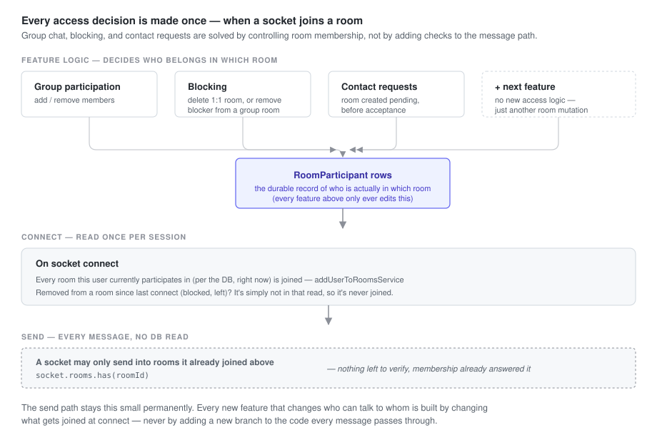

# Echo

A real-time messaging application built as a deliberate exercise in applying **Hexagonal Architecture (Ports & Adapters) + Domain-Driven Design end to end** — MVVM + DDD + Hex on the client, DDD + Hex on the server. Chat is the vehicle, not the point: it's a small enough domain to fully model, but rich enough (live delivery, membership/access rules, offline sync) to force real architectural decisions instead of toy-app ones.

Chat was chosen as the domain because it's the simplest product that genuinely needs both a live transport and a request/response transport at once — a message send is a live event, but auth, sync, and room creation are ordinary requests. Any product needing live bidirectional state (ride-sharing, delivery tracking, collaborative editing) needs the same underlying pattern; chat just makes it easy to build and demo.

## Domains

| Domain | Server | Client | Status |
| --- | --- | --- | --- |
| `authAndAccess` | ✅ | ✅ | Identity (`User`) and the social/access graph (`Contacts`) — one bounded context, two aggregates, sharing the purpose "who is this person, who can they reach." |
| `conversations` | ✅ | ✅ | `Room` aggregate root; `Participant` is an entity it alone controls. Owns membership, not messages. |
| `messaging` | ✅ | ✅ | `Message` aggregate root, references `roomId` by id — a separate aggregate from `Room` because no operation on either needs to atomically touch the other. |
| `presence` | 🚧 | 🚧 | Reserved for online/offline + typing indicators (design in `project_architectural_insights`; Redis TTL/heartbeat approach chosen and researched, not yet built). |
| `sync` | 🚧 | 🚧 | Reserved for the cross-domain read-model that composes rooms + messages + contacts into one bootstrap/delta payload for the client — currently that orchestration lives inline in `authAndAccess` and needs to move once the shape settles. |

## Architecture

Echo is built on **Hexagonal Architecture (Ports & Adapters)**, applied consistently across both client and server, with **Domain-Driven Design** structuring what sits inside that hexagon: the server is organized into bounded contexts, each with its own aggregate roots, domain models, and repositories. Nothing outside a domain ever imports another domain's repository or ORM types directly — only its exposed services. Business logic (use cases) never imports a framework directly either; it depends on a *port* (an interface), and a concrete *adapter* (Express route, Mongoose repo, Dexie table, Socket.IO handler) implements that port. Swap Mongo for Postgres, or REST for gRPC, and the use cases underneath don't change.

**On the client, MVVM sits on top of the same hexagonal core, and React is treated as just another driving adapter.** Code is organized by domain rather than by technical layer, and each domain follows Model → Service → Controller → ViewModel → View. Controllers are plain functions — no React import, no hook, nothing that assumes a render cycle exists — and they're the single entry point into a domain's behavior: every decision ("is there an active room to send to," "what does a failed result mean for this operation") lives there, not scattered across whichever ViewModel happens to trigger it. A ViewModel's job is narrower than it sounds: subscribe to whatever React/Zustand state a View needs (only a hook can do that part), forward it into a controller untouched, and expose the controller's output in whatever shape the View binds to — it never itself decides what a piece of state *means*. The practical result: the entire application core — controllers, services, domain models, persistence — has zero dependency on React existing at all. It's provable, not just claimed: a controller can be called directly from a plain Node script, with no renderer, no DOM, no test harness, and it'll do exactly what the web UI does, because the web UI calls the same function.

**Domain models are hydrated from persistence, never from each other.** There's no canonical "User" that other domains' models are derived from — `authAndAccess`'s `User`, `conversations`' `Participant`, and `messaging`'s `Sender` are three independent representations of "a person," each shaped by what its own bounded context's language actually needs (a `Participant` doesn't need a password; a `Contact` doesn't need room-membership status), each hydrated straight from the database by its owning domain's repository. Every aggregate exposes its presentable shape through one method, `toDTO()`, defined once on the aggregate itself — never re-derived ad hoc by whichever controller happens to need a view of it.

The client rebuild is the clearest evidence of what this buys: before it, the client had no domain models at all, so "what does this room's participant data mean" was answered by hand at every call site that needed it, three separate times, each slightly differently:

```ts
// roomPresentation.ts — deriving "my status" and "is this 1:1"
const myParticipant = room.participants.find(
  (participant) => participant.user.id === ctx.currentUserId,
);
myStatus: myParticipant?.status ?? "pending",
isOneOnOne: room.participants.length === 2,
```

```ts
// useHasPendingRequests.ts — the same "am I pending" check, re-derived independently
return rooms.some((room) =>
  room.participants.some(
    (participant) =>
      participant.user.id === userId && participant.status === "pending",
  ),
);
```

```ts
// createNewRoomService.ts — the same "is this 1:1 with this contact" check, a third time
const isOneOnOne = room.participants.length === 2;
const hasContact = room.participants.some((p) => p.user.id === contact.id);
```

Three call sites, three hand-rolled traversals of `room.participants`, each free to drift from the others since nothing forced them to agree. `Room.hydrate()` now owns this once, and every call site asks the aggregate instead of re-deriving the answer:

```ts
room.statusFor(userId)        // replaces the roomPresentation.ts lookup
room.isPendingFor(userId)     // replaces the useHasPendingRequests.ts check
room.isOneOnOne()             // replaces both length === 2 checks
room.hasParticipant(userId)   // replaces the createNewRoomService.ts .some(...)
```

### Why this much architecture for a 5-domain app

A fair first reaction to this repo is "hex + DDD + MVVM for a chat app is a lot of ceremony." It is — measured against the domain's *current* size. It isn't, measured against what actually happened while building it.

Both the client and server went through an unstructured version before this one, and both hit the same wall independently, by the time the project crossed roughly 5000 lines of source across the whole codebase. The failure mode wasn't bugs — it was that the same question got answered slightly differently in multiple places because nothing signaled "this already exists, call it." On the client, several hooks independently re-implemented "is this room still pending for me" with subtly different logic. On the server, services reached into other domains' repositories directly and duplicated Mongo-populate/field-mapping logic per call site, because there was no enforced surface for what a domain exposed versus kept private — so a business rule (like a block check) had to be re-derived, and could drift, everywhere it was needed.

That's the actual justification, and it doesn't show up if you evaluate the architecture by file count or lines of boilerplate for *this* domain size — it shows up in change cost over time: can a new feature be added without re-deriving something that already exists; can you tell what a domain promises the rest of the app without reading every file in it; can persistence internals change without a cross-domain ripple. Those are exactly the properties the unstructured version didn't have, concretely, not hypothetically — both rebuilds exist because of a real wall, not a preference for pattern names.

### Combining HTTP and WebSocket under one core

Most chat tutorials bolt Socket.IO onto an Express app and let the two transports tangle — sockets reaching into HTTP-layer code, or business logic split unpredictably across both. Echo treats HTTP and WebSocket as two interchangeable *driving adapters* into the same application core. A message send, a room creation, and a login all look identical from the use case's perspective regardless of which transport triggered them — which is what makes it possible to add a new real-time feature without ever touching how an existing HTTP feature works, and vice versa.

### One access boundary, reused for every feature: room membership

Supporting 1:1 chat, group chat, contact requests, and blocking together is not four features stacked on top of each other — combined, they raise a specific set of hard problems:

- **Every send has to answer several questions at once** — is the sender actually in this room, are they blocked by anyone else in it, has the room even survived a block — and a naive implementation answers each with its own check, stacked on the one code path every message runs through.
- **1:1 and group blocking are not the same operation.** Blocking in a 1:1 has to end the conversation for both people; blocking in a group has to remove one person while N‑1 others carry on unaffected. Treated as one feature, this becomes `if (isGroup) / else` duplicated everywhere blocking is enforced.
- **A pending request breaks if access is gated on its status.** If delivery itself depended on `pending → accepted`, every message would have to ask "did the recipient accept *yet*," including the message sent the instant before they do — a race condition by construction. Real platforms don't gate delivery on this at all; they only change where the message is shown.
- **Blocking has to stay consistent across every shared room and every device, not just the one action that triggered it.** Two people can share both a 1:1 and a group room at once; a block has to resolve correctly in both places, and every one of the blocker's and blocked user's other devices need to agree immediately.
- **None of this can be trusted from the client.** A client that still believes it's in a room, un-blocked, or accepted has no bearing on whether it actually is — which means whatever the server checks, it has to check for real, every time, or the whole model is just cosmetic.

Echo resolves all five by reducing every one of them to a single question, answered in one place: *does this user's `Room` aggregate say they're a participant, right now?* `Room` (in the `conversations` domain) is the aggregate root; each member is a `Participant` entity it alone controls — nothing outside `Room`'s own methods (`acceptParticipant`, `removeParticipant`) can change membership state. Blocking removes a participant (the whole room, for 1:1; just that participant, for group) via `Room.removeParticipant`. A pending invite is a participant that already exists, just in `pending` status — labeled differently on the client, never gated. None of this logic lives anywhere near message delivery; it lives entirely in the `Room` aggregate, which only has to stay correct in the database.

<picture>
  <source media="(prefers-color-scheme: dark)" srcset="docs/access-boundary-dark.svg">
  
</picture>

The send path is deliberately unremarkable — one in-memory membership check, no query, no per-feature branch — and that's the payoff of getting the modeling right upstream, not a shortcut taken instead of it. A new feature that changes who can talk to whom is built by changing what a socket joins at connect time; the code every message runs through never has to grow to accommodate it.

### Client is offline-first, not just cached

Every message, room, and contact is persisted locally in IndexedDB (via Dexie) and the UI renders from that local store, not from in-flight network state. The server is reconciled in through a cold sync on load and a single generic `room:updated` live event that any room-mutating action can emit — one push mechanism reused across every feature that changes a room, instead of each feature inventing its own socket event and its own client handler.

### Two real shells, not one responsive layout

`DesktopShell` and `MobileShell` both mount at the root simultaneously (`RootLayout.tsx`) and visibility is switched purely with responsive Tailwind classes — there's no JS media-query branching deciding which one renders. Each shell has its own navigation model and composes the same feature components differently: desktop is a persistent sidebar + panel layout, mobile is a bottom-tab, single-screen-at-a-time layout closer to a native app than a shrunk-down website. The goal was to make "responsive" mean *two designed experiences sharing one codebase*, not one layout that degrades gracefully.

### Planned: a third UI, same core, as proof the architecture actually holds

Not yet built. Once the controller layer above is in place, the plan is a third driving adapter alongside desktop and mobile: a terminal-styled interface, rendered in-browser (so it stays reachable with one link and keeps the existing cookie/session auth flow — a real installable CLI would need a separate distribution story and isn't worth the friction for a demo). It would call the exact same controllers the normal UI calls — no duplicated business logic, only new input/output plumbing, the same relationship the server's HTTP and Socket.IO adapters already have to *its* controllers. The point isn't the aesthetic; it's a live, checkable demonstration that the hexagonal boundary is real rather than asserted — the same core driving a second, structurally unrelated interface.

## Stack

**Client**: React 19, Vite, TypeScript, React Router 7, Zustand (auth state), Axios (HTTP client with auto access-token refresh on 401), Dexie (offline cache/IndexedDB), Zod (schema validation at every API/socket boundary), Tailwind, shadcn/base-ui primitives, Lucide icons.

**Server**: Express 5, TypeScript, MongoDB/Mongoose, Socket.IO, Zod (request/payload validation), JWT auth, Redis (connected, reserved for presence work below — not yet driving any feature).

Zod schemas are the single source of truth for types on both sides — TypeScript types are derived from them (`z.infer`), never hand-duplicated, so a shape only has to be defined once and both validation and typing stay in sync.

## Running locally

No root-level script runner — start client and server independently in separate terminals.

```
cd server && npm install && npm run dev   # http://localhost:3000
cd client && npm install && npm run dev   # http://localhost:5173
```

Server `.env`:
```
JWT_SECRET=
MONGO_URI=
MONGO_DB=echo
PORT=3000
```

Client `.env`:
```
VITE_API_URL=http://localhost:3000
```

## What's built

- **Auth** — registration, login, JWT-based sessions.
- **Contacts** — search by email, add, block (with mutual removal, shared-room cleanup, and live notification to affected users).
- **Real-time messaging** — send/receive over Socket.IO, delivered to every device joined to a room.
- **Contact requests** — Instagram-style: messaging a non-contact creates a pending room instead of requiring mutual acceptance first. The recipient sees it in a separate requests list and can accept from there or implicitly by replying.
- **Offline-first sync** — full state cached in IndexedDB, with delta sync on reconnect and live updates via the shared `room:updated` event.
- **Group chats** — in progress. The domain layer already supports N-participant rooms with no schema or service changes; remaining work is client UI.

## Deferred

- Presence / typing indicators / delivery & read receipts (`presence` domain — reserved, not yet implemented)
- Message reactions, edit, delete
- End-to-end encryption

## Current API surface

| Method | Path                       | Purpose                          |
|--------|-----------------------------|-----------------------------------|
| POST   | /auth/register               | Create account                    |
| POST   | /auth/login                  | Authenticate, issue JWT           |
| POST   | /auth/verify                 | Refresh session                   |
| GET    | /user/sync                   | Delta/cold sync of user's data    |
| POST   | /contacts/search              | Search users by email             |
| POST   | /contacts/add                 | Add a contact                     |
| POST   | /contacts/block                | Block a contact                   |
| POST   | /rooms                        | Create a room                     |
| POST   | /rooms/accept-invite          | Accept a pending room invite      |
| GET    | /health                       | Health check                      |

Socket events: `message:send` / `message:receive`, `room:updated`, `room:blocked`.
