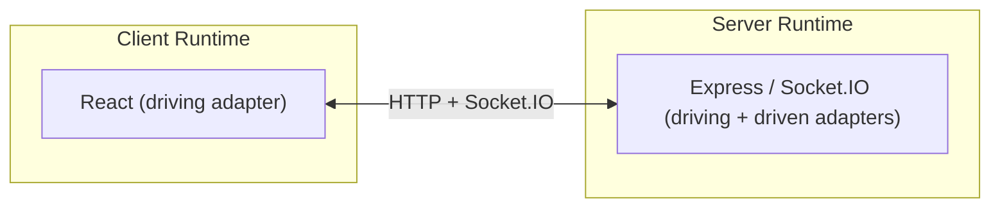
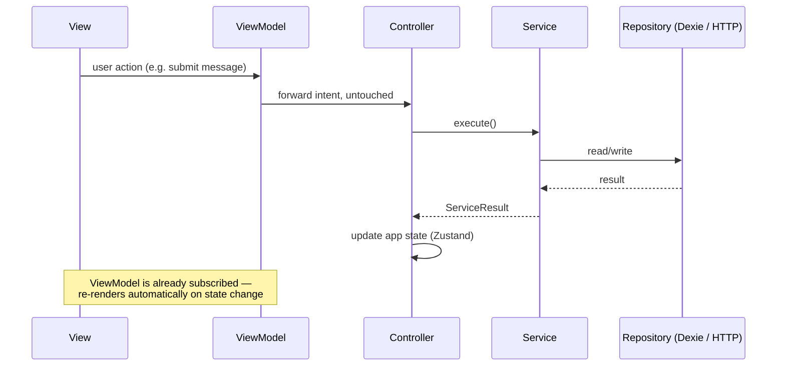
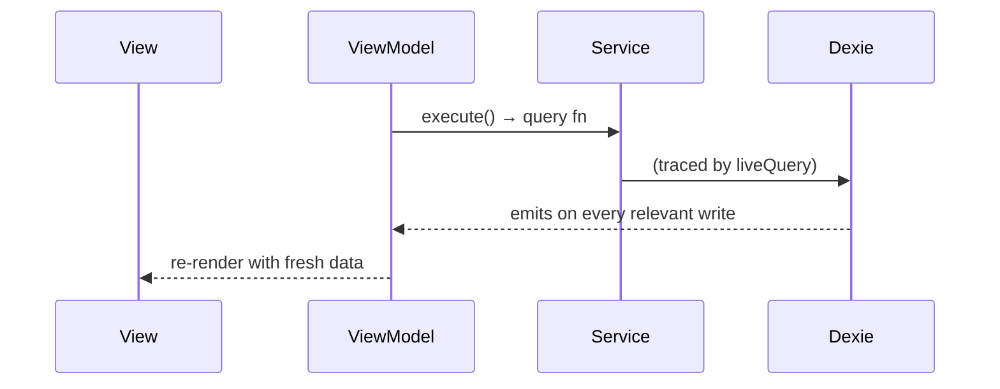
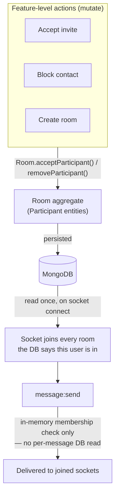

# Echo

> What if the application, not the framework, was the thing you actually designed?

This project is about architecture. I wanted one application core, expressed the same way on the client and the server, decoupled from React and Express to the point that either could be deleted and the core would still work correctly. Chat is what I used to build that around, since it needs two transports at the same time (a message send is a live event, auth and sync are ordinary requests) and enough cross-cutting rules — membership, blocking, offline sync — that the modeling actually gets hard. That's why chat is here. It's not really what the project is about.

Domain-Driven Design and Hexagonal Architecture are applied end to end on both sides — MVVM + DDD + Hex on the client, DDD + Hex on the server. React, Express, Socket.IO, MongoDB, and IndexedDB all do real work, but none of them own the application. Each one is an adapter plugged into a core that exists whether or not it's running.

---

## The idea

Most web apps get designed through the framework's vocabulary. A feature starts as:

- Which React component should own this?
- Which hook should manage this state?
- Which Express route should this live in?
- Which Socket.IO event should send this?

The framework becomes the language the application gets designed in. So the application's shape ends up wherever the framework's conventions put it, instead of where the domain actually needs it.

I designed Echo from the opposite starting point:

- What business capability is being introduced?
- Which domain owns it?
- Which application service coordinates it?
- What state changes as a result?
- Which delivery mechanism exposes that behavior?

Frameworks get introduced after that's already answered, to deliver an application that already has a shape.

### Why this matters

The usual pitch for Hexagonal Architecture is that you can swap out infrastructure — a repository implementation, the socket transport, an auth adapter — without touching the application underneath. That's true, and it happens here too. But the code still looks like a normal React app and a normal Express app on the surface. The point isn't hiding the framework. It's making sure the framework isn't where the application's logic lives.

The payoff shows up before anyone ever swaps anything out:

- Every controller, service, and domain model can be exercised with zero React and zero Express running. A controller can be called from a plain Node script and it does exactly what the UI does, because the UI calls the same function.
- A business rule lives in exactly one place — the aggregate that owns it — so it can't drift between three call sites that each re-derived it slightly differently.
- A new delivery mechanism (a new UI, a new transport) gets built as a new adapter against an application that already exists, instead of business logic getting rewritten into a new framework's conventions.

Being able to swap infrastructure out is a side effect of building it this way. It wasn't the goal.

### The proof: the whole system runs headless

I can test both sides without ever starting the framework each one normally needs.

The server's entire API surface is exercised through `createApp()` in-process — `supertest` calls the Express app object directly. There's no `server.listen()`, no open port, no network socket involved in the test run.

The client side goes further. `client/src/tests/e2e/` calls the client's real controllers — `authControllers.register`, `authControllers.login`, `authControllers.deleteAccount` — against a server that's actually running, over real HTTP, with a real database. No browser, no DOM, no React renderer anywhere in the process:

```text
register (real POST /auth/register)
  → login (real POST /auth/login, real JWT issued)
  → delete account (real POST /auth/delete-account, real Bearer auth, real cookie cleared)
  → login again with the same credentials → fails, proving the account is actually gone
```

That test can only exist because the application core genuinely doesn't need React to exist. If the client's business logic secretly depended on a mounted component tree, proving this would require browser automation instead — Playwright or Cypress, clicking through a UI. A plain Vitest file driving the whole system, front to back, is what makes the decoupling claim checkable instead of asserted.

This isn't just how the app gets tested. It's how it got built. Every use case on the client — register, login, delete account, send a message — was written, wired, and verified through controllers and services before any component existed to call them. The UI is currently stripped down to markup with no ViewModel wiring at all (see [In progress](#in-progress)), and none of the work above depended on that changing. Building headless and testing headless are the same discipline applied at two different points in time.

The client and server each have their own unit and integration coverage underneath this too — the client's controllers/services/repos unit-tested with fakes, the server's integration-tested against a real database. Both are real and necessary, but neither is the headline. See [Running locally](#running-locally) for how to run the e2e suite.

---

## One application, two environments

Echo isn't a frontend and a backend bolted together — it's one application, delivered through two different runtimes that both point back at the same architectural core.



Both sides are built on the same layered shape — a driving adapter (something that *calls into* the application) at the edge, the application core in the middle, and driven adapters (things the application *calls out to*, like a database) on the other side.


Nothing at the center of that diagram is React, Express, or Socket.IO. It's the application.

---

## How a request actually flows

Concretely, on the client: a `View` never touches a service, a store setter, or a repository directly. It calls whatever a `ViewModel` exposes. The `ViewModel` either subscribes to state (a Zustand store, or a `liveQuery` over IndexedDB) or forwards an intent to a `Controller`. Controllers are the *only* thing allowed to mutate application state — services below them never touch a store, the same way a service never imports Express; state is a UI-framework detail the domain has no business knowing about.



For read paths sourced from the local IndexedDB cache, the ViewModel skips the controller entirely and subscribes straight to a service-backed `liveQuery` — there's nothing to *decide* in a read, only data to relay, so routing it through a controller would just be needless indirection:



The result: the application core — controllers, services, domain models, persistence — has zero dependency on React existing at all, and the view layer has zero dependency on *how* application state is produced. Each side can be built, and tested, without the other one running.

---

## Domains

| Domain | Server | Client | Status |
| --- | --- | --- | --- |
| `authAndAccess` | ✅ | ✅ | Authentication (`AuthUser`), public identity (`Identity`), and the social/access graph (`Contacts`) — one bounded context, sharing the purpose "who is this person, who can they reach," each concept scoped to exactly the callers that need it. |
| `conversations` | ✅ | ✅ | `Room` aggregate root; `Participant` is an entity it alone controls. Owns membership, not messages. |
| `messaging` | ✅ | ✅ | `Message` aggregate root, references `roomId` by id — a separate aggregate from `Room` because no operation on either needs to atomically touch the other. |
| `sync` | ✅ | ✅ | Owns the cross-domain read-model that composes rooms + messages + contacts into one bootstrap/delta payload, and (client-side) the local `SyncContext` cursor that tracks when the device last synced. |
| `presence` | 🚧 | 🚧 | Reserved for online/offline + typing indicators (design in `project_architectural_insights`; Redis TTL/heartbeat approach chosen and researched, not yet built). |

## Architecture

Echo is built on **Hexagonal Architecture (Ports & Adapters)**, applied consistently across both client and server, with **Domain-Driven Design** structuring what sits inside that hexagon: the server is organized into bounded contexts, each with its own aggregate roots, domain models, and repositories. Nothing outside a domain ever imports another domain's repository or ORM types directly — only its exposed services. Business logic (use cases) never imports a framework directly either; it depends on a *port* (an interface), and a concrete *adapter* (Express route, Mongoose repo, Dexie table, Socket.IO handler) implements that port.

**On the client, MVVM sits on top of the same hexagonal core, and React is treated as just another driving adapter.** Code is organized by domain rather than by technical layer, and each domain follows Model → Service → Controller → ViewModel → View. Controllers are plain functions — no React import, no hook, nothing that assumes a render cycle exists — and they're the single entry point into a domain's behavior: every decision ("is there an active room to send to," "what does a failed result mean for this operation") lives there, not scattered across whichever ViewModel happens to trigger it. A ViewModel's job is narrower than either: subscribe to whatever state a View needs, forward intents into a controller untouched, and expose real domain data in whatever shape *the concern itself* needs — never the shape a specific component's current markup happens to want, which would make the ViewModel depend on the View instead of the other way around. Every user-triggered action in the app — login, register, add a contact, accept a room invite, select a room, create a room, send a message — has exactly one controller as its entry point, each named for the action it performs, so the `controllers/` folder in any domain is a literal table of contents of what that domain lets a user do.

**Domain models are hydrated from persistence, never from each other.** There's no canonical "User" that other domains' models are derived from — `authAndAccess`'s `Identity`, `conversations`' `Participant`, and `messaging`'s `Sender` are independent representations of "a person," each shaped by what its own bounded context's language actually needs (a `Participant` doesn't need a password; a `Contact` doesn't need room-membership status), each hydrated straight from the database by its owning domain's repository. Every aggregate exposes its presentable shape through one method, `toDTO()`, defined once on the aggregate itself — never re-derived ad hoc by whichever controller happens to need a view of it.

The client rebuild is the clearest evidence of what this buys: before it, the client had no domain models at all, so "what does this room's participant data mean" was answered by hand at every call site that needed it, three separate times, each slightly differently:

```ts
// roomPresentation.ts — deriving "my status" and "is this 1:1"
const myParticipant = room.participants.find(
  (participant) => participant.user.id === ctx.currentUserId,
);
myStatus: myParticipant?.status ?? "pending",
isOneOnOne: room.participants.length === 2,
```

```ts
// useHasPendingRequests.ts — the same "am I pending" check, re-derived independently
return rooms.some((room) =>
  room.participants.some(
    (participant) =>
      participant.user.id === userId && participant.status === "pending",
  ),
);
```

```ts
// createNewRoomService.ts — the same "is this 1:1 with this contact" check, a third time
const isOneOnOne = room.participants.length === 2;
const hasContact = room.participants.some((p) => p.user.id === contact.id);
```

Three call sites, three hand-rolled traversals of `room.participants`, each free to drift from the others since nothing forced them to agree. `Room.hydrate()` now owns this once, and every call site asks the aggregate instead of re-deriving the answer:

```ts
room.statusFor(userId)        // replaces the roomPresentation.ts lookup
room.isPendingFor(userId)     // replaces the useHasPendingRequests.ts check
room.isOneOnOne()             // replaces both length === 2 checks
room.hasParticipant(userId)   // replaces the createNewRoomService.ts .some(...)
```

**A second, different kind of DDD payoff: splitting one concept into two when it's actually two.** `authAndAccess` originally had a single `User` domain model — `{id, firstName, lastName, email, password}` — used both to authenticate someone and to describe a person to any other caller (a successful login response, a contact search result). That's actually two different concepts wearing one name: `password` belongs to the *authentication* use case only, and every non-auth caller that received a `User` was silently exposed to a field it had no business seeing, papered over by a separate, disconnected `usersPresenter.ts` that stripped it back out by hand. The fix wasn't a leaner DTO — it was recognizing `authAndAccess` needed two representations of a person: `AuthUser` (full shape, `password` included, never leaves the domain) for login/registration/token logic, and `Identity` (`{id, firstName, lastName, email}`, its own hydration, its own file) for every caller outside that concern. `usersPresenter.ts` — a stripping-after-the-fact workaround — no longer exists; there's nothing left for it to strip, because the right shape is now constructed in the first place.

### Why this much architecture for a 5-domain app

A fair first reaction to this repo is "hex + DDD + MVVM for a chat app is a lot of ceremony." It is — measured against the domain's *current* size. It isn't, measured against what actually happened while building it.

Both the client and server went through an unstructured version before this one, and both hit the same wall independently, by the time the project crossed roughly 5000 lines of source across the whole codebase. The failure mode wasn't bugs — it was that the same question got answered slightly differently in multiple places because nothing signaled "this already exists, call it." On the client, several hooks independently re-implemented "is this room still pending for me" with subtly different logic. On the server, services reached into other domains' repositories directly and duplicated Mongo-populate/field-mapping logic per call site, because there was no enforced surface for what a domain exposed versus kept private — so a business rule (like a block check) had to be re-derived, and could drift, everywhere it was needed.

That's the actual justification, and it doesn't show up if you evaluate the architecture by file count or lines of boilerplate for *this* domain size — it shows up in change cost over time: can a new feature be added without re-deriving something that already exists; can you tell what a domain promises the rest of the app without reading every file in it; can persistence internals change without a cross-domain ripple. Those are exactly the properties the unstructured version didn't have, concretely, not hypothetically — both rebuilds exist because of a real wall, not a preference for pattern names.

### Combining HTTP and WebSocket under one core

Most chat tutorials bolt Socket.IO onto an Express app and let the two transports tangle — sockets reaching into HTTP-layer code, or business logic split unpredictably across both. Echo treats HTTP and WebSocket as two interchangeable *driving adapters* into the same application core. A message send, a room creation, and a login all look identical from the use case's perspective regardless of which transport triggered them — which is what makes it possible to add a new real-time feature without ever touching how an existing HTTP feature works, and vice versa.

### One access boundary, reused for every feature: room membership

Supporting 1:1 chat, group chat, contact requests, and blocking together is not four features stacked on top of each other — combined, they raise a specific set of hard problems:

- **Every send has to answer several questions at once** — is the sender actually in this room, are they blocked by anyone else in it, has the room even survived a block — and a naive implementation answers each with its own check, stacked on the one code path every message runs through.
- **1:1 and group blocking are not the same operation.** Blocking in a 1:1 has to end the conversation for both people; blocking in a group has to remove one person while N‑1 others carry on unaffected. Treated as one feature, this becomes `if (isGroup) / else` duplicated everywhere blocking is enforced.
- **A pending request breaks if access is gated on its status.** If delivery itself depended on `pending → accepted`, every message would have to ask "did the recipient accept *yet*," including the message sent the instant before they do — a race condition by construction. Real platforms don't gate delivery on this at all; they only change where the message is shown.
- **Blocking has to stay consistent across every shared room and every device, not just the one action that triggered it.** Two people can share both a 1:1 and a group room at once; a block has to resolve correctly in both places, and every one of the blocker's and blocked user's other devices need to agree immediately.
- **None of this can be trusted from the client.** A client that still believes it's in a room, un-blocked, or accepted has no bearing on whether it actually is — which means whatever the server checks, it has to check for real, every time, or the whole model is just cosmetic.

Echo resolves all five by reducing every one of them to a single question, answered in one place: *does this user's `Room` aggregate say they're a participant, right now?* `Room` (in the `conversations` domain) is the aggregate root; each member is a `Participant` entity it alone controls — nothing outside `Room`'s own methods (`acceptParticipant`, `removeParticipant`) can change membership state. Blocking removes a participant (the whole room, for 1:1; just that participant, for group) via `Room.removeParticipant`. A pending invite is a participant that already exists, just in `pending` status — labeled differently on the client, never gated. None of this logic lives anywhere near message delivery; it lives entirely in the `Room` aggregate, which only has to stay correct in the database.



The send path is deliberately unremarkable — one in-memory membership check, no query, no per-feature branch — and that's the payoff of getting the modeling right upstream, not a shortcut taken instead of it. A new feature that changes who can talk to whom is built by changing what a socket joins at connect time; the code every message runs through never has to grow to accommodate it.

### Client is offline-first, not just cached

Every message, room, and contact is persisted locally in IndexedDB (via Dexie) and the UI renders from that local store, not from in-flight network state. The server is reconciled in through a cold sync on load and a single generic `room:updated` live event that any room-mutating action can emit — one push mechanism reused across every feature that changes a room, instead of each feature inventing its own socket event and its own client handler.

### Two real shells, not one responsive layout

`DesktopShell` and `MobileShell` both mount at the root simultaneously (`RootLayout.tsx`) and visibility is switched purely with responsive Tailwind classes — there's no JS media-query branching deciding which one renders. Each shell has its own navigation model and composes the same feature components differently: desktop is a persistent sidebar + panel layout, mobile is a bottom-tab, single-screen-at-a-time layout closer to a native app than a shrunk-down website. The goal was to make "responsive" mean *two designed experiences sharing one codebase*, not one layout that degrades gracefully.

### Planned: a third UI, same core, as proof the architecture actually holds

Not yet built, but the dependency is now cleared — the client controller layer described above is in place. The plan is a third driving adapter alongside desktop and mobile: a terminal-styled interface, rendered in-browser (so it stays reachable with one link and keeps the existing cookie/session auth flow — a real installable CLI would need a separate distribution story and isn't worth the friction for a demo). It would call the exact same controllers the normal UI calls — no duplicated business logic, only new input/output plumbing, the same relationship the server's HTTP and Socket.IO adapters already have to *its* controllers. The point isn't the aesthetic; it's a live, checkable demonstration that the hexagonal boundary is real rather than asserted — the same core driving a second, structurally unrelated interface.

---

## Stack

**Client**: React 19, Vite, TypeScript, React Router 7, Zustand (auth + UI-selection state), Axios (HTTP client with auto access-token refresh on 401), Dexie (offline cache/IndexedDB, driving reactive reads via `liveQuery`), Zod (schema validation at every API/socket boundary), Tailwind, shadcn/base-ui primitives, Lucide icons.

**Server**: Express 5, TypeScript, MongoDB/Mongoose, Socket.IO, Zod (request/payload validation), JWT auth, Redis (connected, reserved for presence work below — not yet driving any feature).

Zod schemas are the single source of truth for types on both sides — TypeScript types are derived from them (`z.infer`), never hand-duplicated, so a shape only has to be defined once and both validation and typing stay in sync.

## Running locally

No root-level script runner — start client and server independently in separate terminals.

```
cd server && npm install && npm run dev   # http://localhost:3000
cd client && npm install && npm run dev   # http://localhost:5173
```

Server `.env`:
```
JWT_ACCESS_SECRET=
JWT_REFRESH_SECRET=
MONGO_URI_LOCAL=mongodb://127.0.0.1:27017
MONGO_URI_ATLAS=
MONGO_DB=echo
PORT=3000
```

`NODE_ENV=production` selects `MONGO_URI_ATLAS`; anything else (local dev, tests) uses `MONGO_URI_LOCAL`, which must be a single-node **replica set** (not the installer's default standalone mode) since `ContactsRepo.saveBlockPair` runs inside a real Mongo transaction. One-time setup: uncomment `replication:` / add `replSetName: rs0` in `mongod.cfg`, restart the service, then `mongosh --eval "rs.initiate()"`.

Client `.env`:
```
VITE_API_URL=http://localhost:3000
```

With both servers running, the cross-boundary e2e suite can be run against them:

```
cd client && npm run test:e2e
```

This is intentionally separate from `npm test` (which runs the fast, mocked unit/integration suites and never needs a live server) — e2e tests hit a real running server and a real database, so they're run deliberately, one workflow at a time, never in parallel with each other.

## What's built

- **Auth** — registration, login, JWT-based sessions (separate access/refresh secrets).
- **Account deletion** — removes the user doc, their contacts doc, dissolves/updates shared rooms, redacts their messages, and disconnects their sockets.
- **Contacts** — search by email, add, block (with mutual removal, shared-room cleanup, and live notification to affected users).
- **Real-time messaging** — send/receive over Socket.IO, delivered to every device joined to a room.
- **Contact requests** — Instagram-style: messaging a non-contact creates a pending room instead of requiring mutual acceptance first. The recipient sees it in a separate requests list and can accept from there or implicitly by replying.
- **Offline-first sync** — full state cached in IndexedDB, with delta sync on reconnect and live updates via the shared `room:updated` event. Sync is now its own domain on both sides (`sync`), with a real `SyncContext` client-side cursor replacing what used to be an ad hoc, untyped bootstrap object.
- **Group chats** — in progress. The domain layer already supports N-participant rooms with no schema or service changes; remaining work is client UI.
- **Headless end-to-end testing** — a real, self-cleaning suite (`client/src/tests/e2e/`) exercising the client's actual controllers against a genuinely running server, no React involved. First workflow proven: register → login → delete account → re-login fails — see [The proof: the whole system runs headless](#the-proof-the-whole-system-runs-headless) above.

## In progress

- **More headless e2e workflows** — messaging (send/receive) and room/contact flows are next, following the same pattern as the register/login/delete-account suite already in place.
- **Client view layer rebuild** — components are currently stripped down to markup only, with no ViewModel wiring at all. This was done on purpose. The observer-hook pattern that used to mirror entire IndexedDB tables into global stores has been removed; reads now flow through scoped repository queries wrapped in `liveQuery`, subscribed to directly by ViewModels. Every use case in the app is already proven to work through controllers, services, and the e2e suite above — none of that depended on a single component existing. Rebuilding the UI on top of that is the last, mechanical step: read what a ViewModel exposes, bind it to markup. If the live demo currently shows an unstyled shell, that's this step not being done yet, not the application underneath being unfinished.

## Deferred

- Presence / typing indicators / delivery & read receipts (`presence` domain — reserved, not yet implemented)
- Message reactions, edit, delete
- End-to-end encryption

## Current API surface

| Method | Path                 | Purpose                                              |
|--------|----------------------|-------------------------------------------------------|
| POST   | /auth/register       | Create account                                       |
| POST   | /auth/login          | Authenticate, issue JWT                              |
| POST   | /auth/verify         | Refresh session                                      |
| POST   | /auth/delete-account | Delete account (cascades contacts, rooms, messages)  |
| GET    | /sync/user           | Delta/cold sync of user's data                       |
| POST   | /contacts/search     | Search users by email                                |
| POST   | /contacts/add        | Add a contact                                        |
| POST   | /contacts/block      | Block a contact                                      |
| POST   | /rooms               | Create a room                                        |
| POST   | /rooms/accept-invite | Accept a pending room invite                         |
| GET    | /health              | Health check                                         |

Socket events: `message:send` / `message:receive`, `room:updated`.
